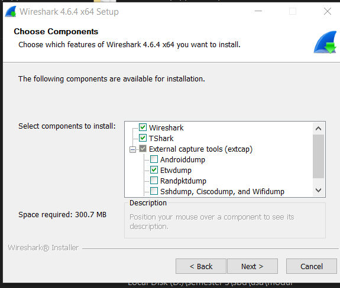
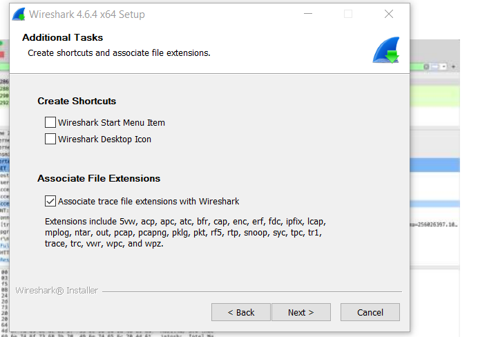
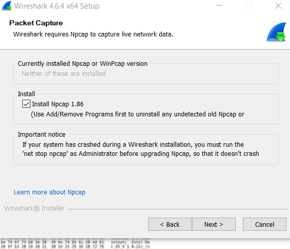
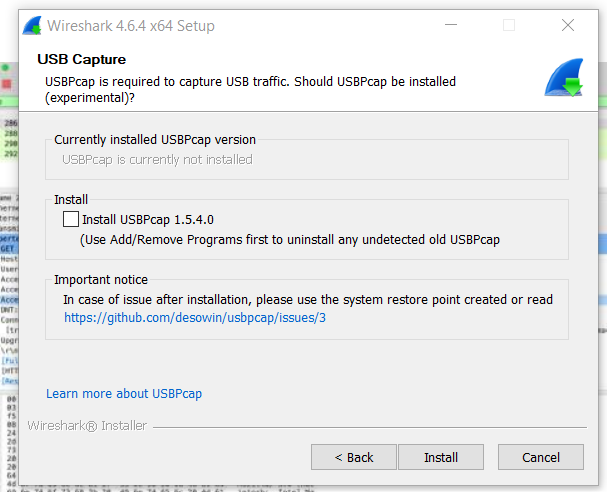
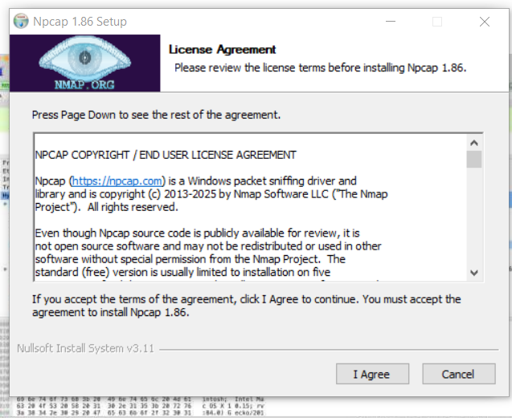
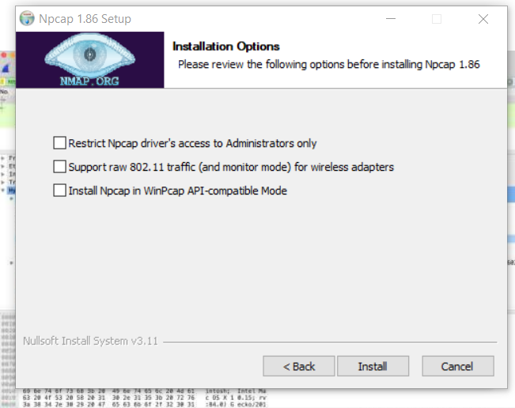
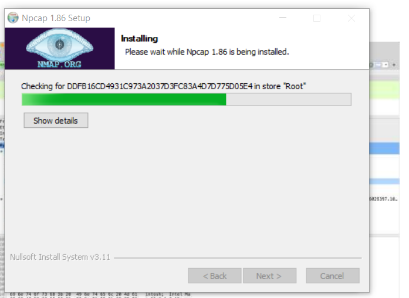

# Running Modul 
Pastikan Wireshark sudah terinstall di komputer. Jika belum terinstall dapat di download pada link berikut http://www.wireshark.org/

### Instalasi Wireshark
jika sudah selesai mendownload selanjutnya lakukan instalasi wireshark

ikuti seperti gambar dibawah ini

setelah itu klik i agree lalu install

tunggu proses instalasi selesai

jika sudah anda bisa menggunakan wireshark sekarang.

### 