# Running Modul 
Pastikan Wireshark sudah terinstall di komputer untuk melakukan praktikum. Jika belum terinstall dapat di download pada link berikut http://www.wireshark.org/

### Instalasi Wireshark
jika sudah selesai mendownload selanjutnya lakukan instalasi wireshark

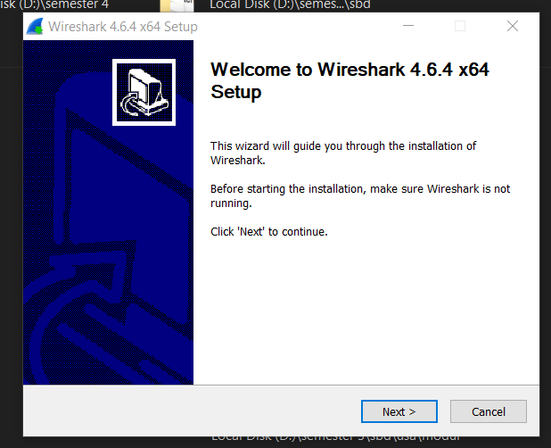

ikuti seperti gambar dibawah ini

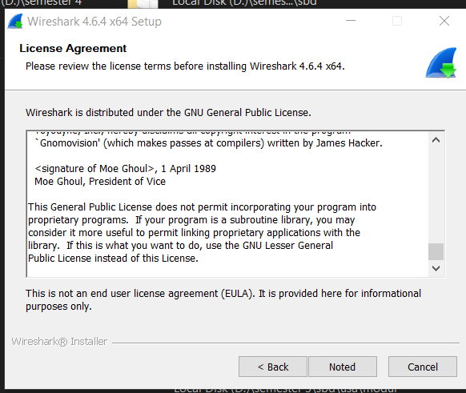
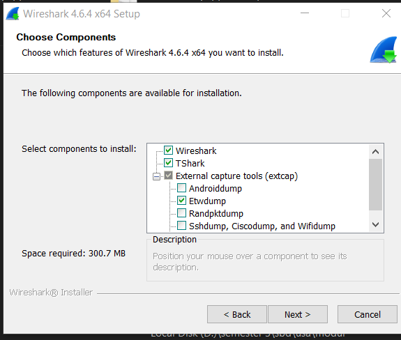
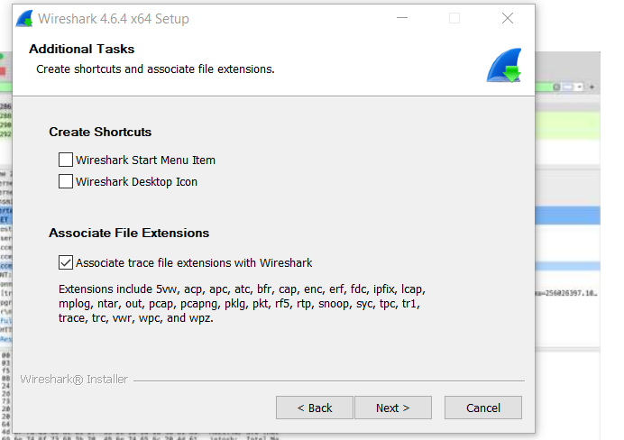
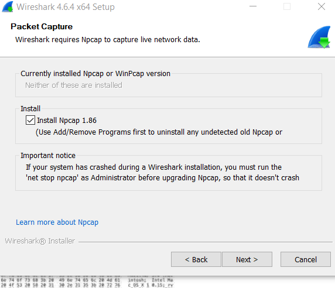
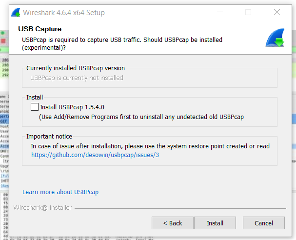

setelah itu klik i agree lalu install

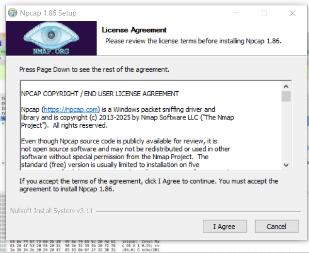
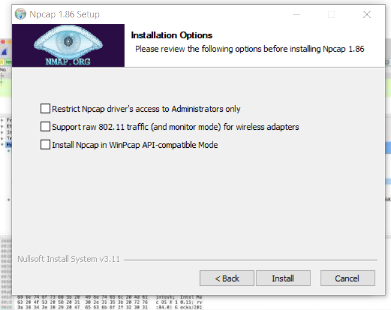

tunggu proses instalasi selesai

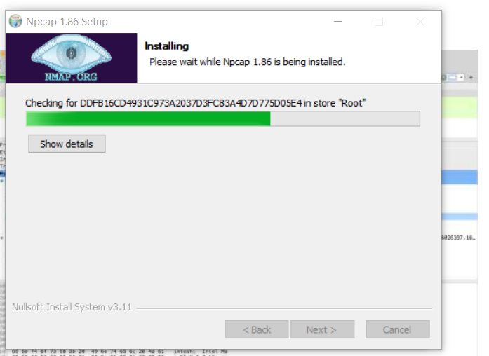

jika sudah anda bisa menggunakan wireshark sekarang.

<<<<<<< HEAD
### Apa itu Wireshark 
Wireshark merupakan perangkat lunak network protocol analyzer yang digunakan untuk menangkap dan menganalisis paket data yang melewati suatu jaringan komputer. Wireshark memungkinkan pengguna melihat secara rinci informasi lalu lintas jaringan seperti alamat IP, protokol yang digunakan, ukuran paket, serta proses komunikasi antar perangkat dalam jaringan.
 
### Masuk ke Wireshark

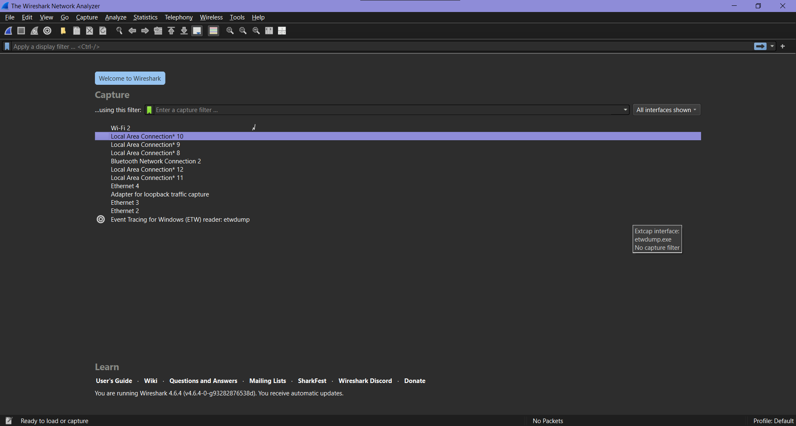

Pada bagian Capture, terdapat daftar yang disebut interfaces.Interface ini digunakan untuk koneksi Wi-Fi. Semua paket data yang masuk dan keluar dari komputer akan melewati interface Wi-Fi tersebut, sehingga proses penangkapan paket dilakukan melalui interface ini.

Untuk memulai proses penangkapan paket, lakukan klik dua kali pada Wifi tersebut. Setelah interface dipilih, Wireshark akan mulai menangkap semua paket yang dikirim maupun diterima oleh interface tersebut. Tampilan kemudian akan menjadi seperti Gambar dibawah ini, yang menunjukkan informasi mengenai paket-paket yang berhasil ditangkap.
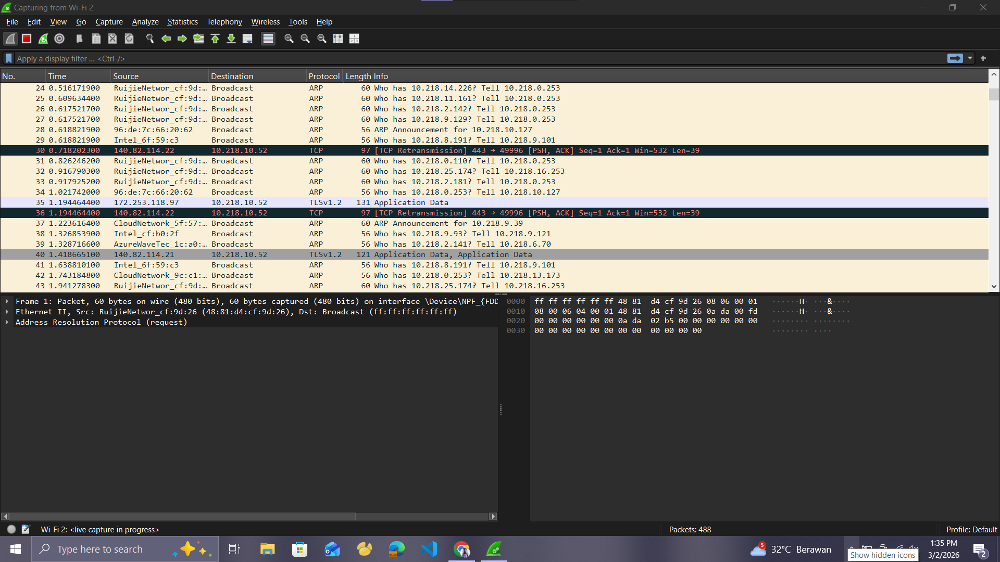

Ketika Wireshark sedang berjalan, klik link ini http://gaia.cs.umass.edu/wiresharklabs/INTRO-wireshark-file1.html

Untuk menampilkan halaman tersebut, browser akan menghubungi server HTTP yang berada di gaia.cs.umass.edu dan melakukan pertukaran pesan HTTP dengan server tersebut untuk mengunduh halaman web yang diminta.

Frame Ethernet atau Wi-Fi yang membawa pesan HTTP tersebut, serta semua frame lain yang melewati adaptor jaringan Ethernet atau Wi-Fi, akan ditangkap oleh Wireshark selama proses pengambilan paket berlangsung.
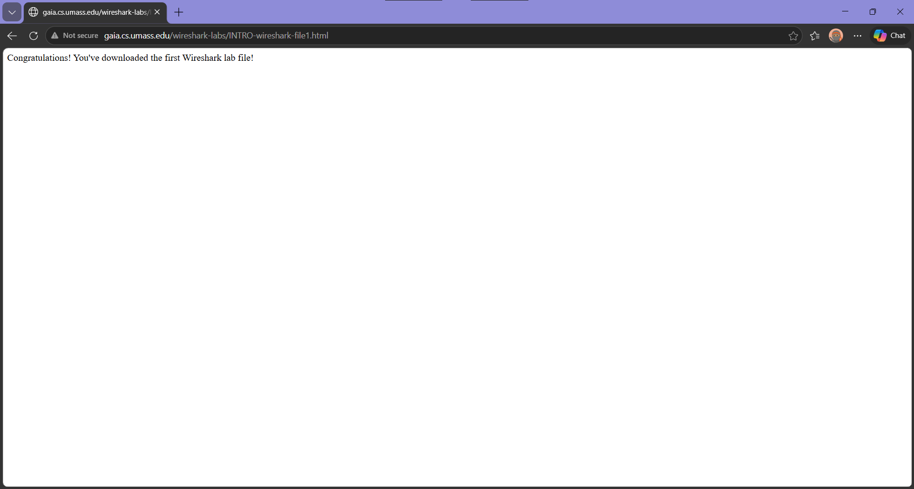

Setelah proses pengambilan paket selesai, kembali ke Wireshark lalu hentikan proses capture dengan menekan ikon kotak merah (Stop Capturing Packet).Selanjutnya, pada bagian Display Filter, ketik “http” untuk menampilkan paket-paket HTTP yang sebelumnya telah diakses melalui browser.

Dari daftar paket yang muncul, pilih paket dengan tipe (text/html). Kemudian klik bagian Line-based text data, sehingga akan terlihat isi halaman web dalam bentuk teks yang sama seperti yang ditampilkan pada browser.
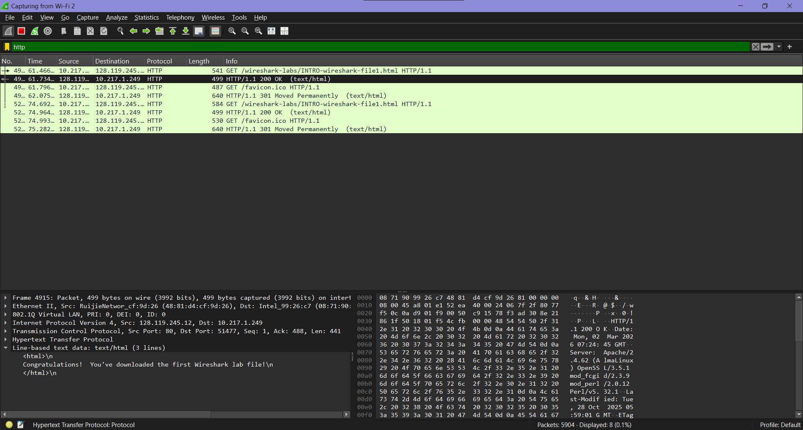

### Cara menjalankan ulang wireshark
Untuk menjalankan kembali proses penangkapan paket pada Wireshark, pengguna dapat membuka menu Capture, kemudian memilih Options. Setelah itu, pilih interface Wi-Fi yang tersedia, lalu lakukan klik dua kali pada interface tersebut untuk memulai kembali proses capture paket jaringan.
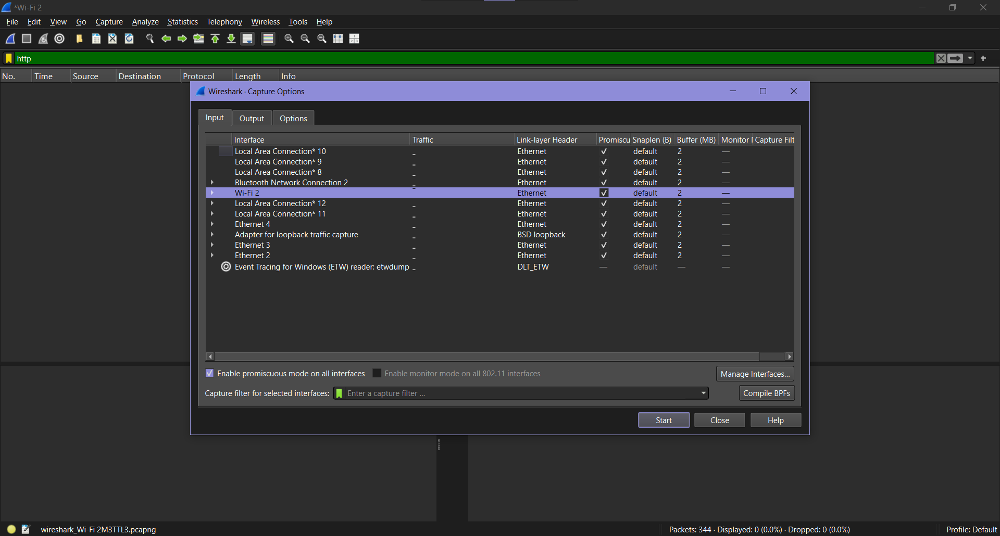

### Kesimpulan
Dapat disimpulkan bahwa Wireshark merupakan alat yang digunakan untuk menangkap paket data melewati jaringan komputer.Dengan menggunakan Wireshark, pengguna dapat melihat berbagai informasi lalu lintas jaringan seperti protokol yang digunakan, alamat IP sumber dan tujuan, serta isi paket data yang dikirimkan.

Melalui proses capture paket, penggunaan display filter HTTP, dan pengamatan terhadap data text/html, dapat diketahui bagaimana browser berkomunikasi dengan server untuk mengambil dan menampilkan halaman web. Hal ini membantu pengguna memahami proses pertukaran data dalam jaringan serta cara kerja protokol HTTP secara lebih jelas.