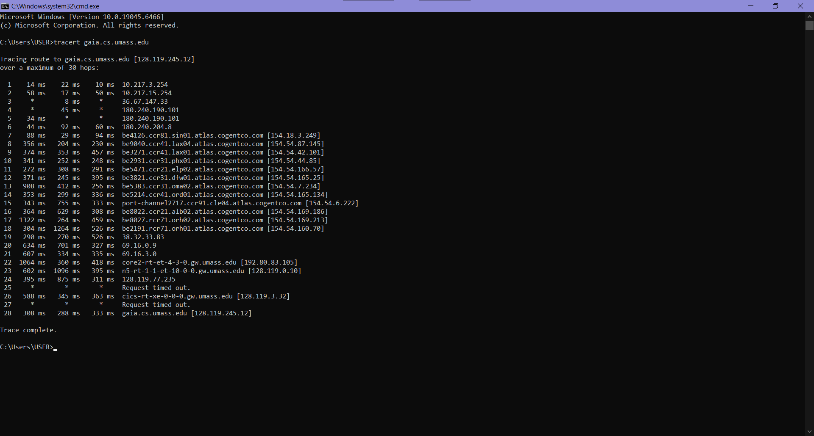
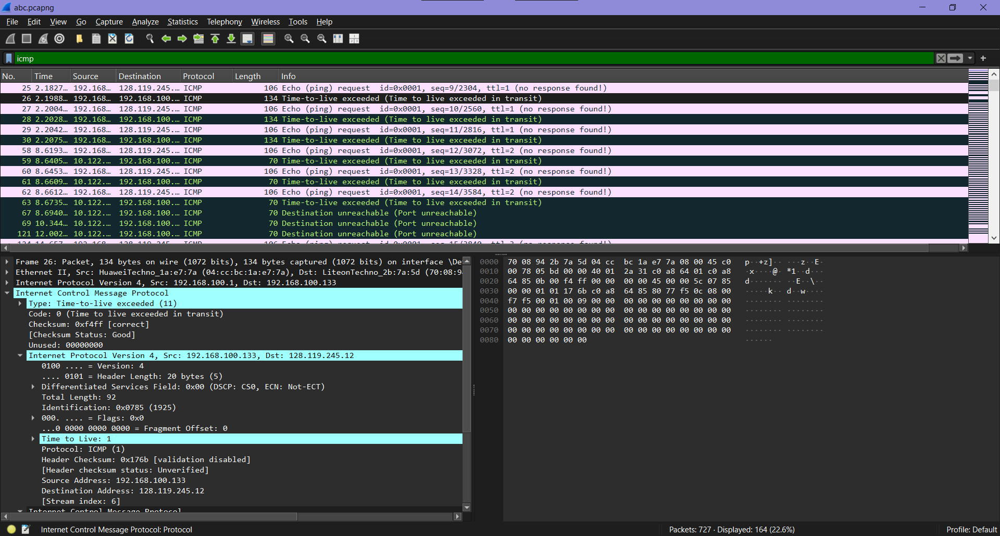
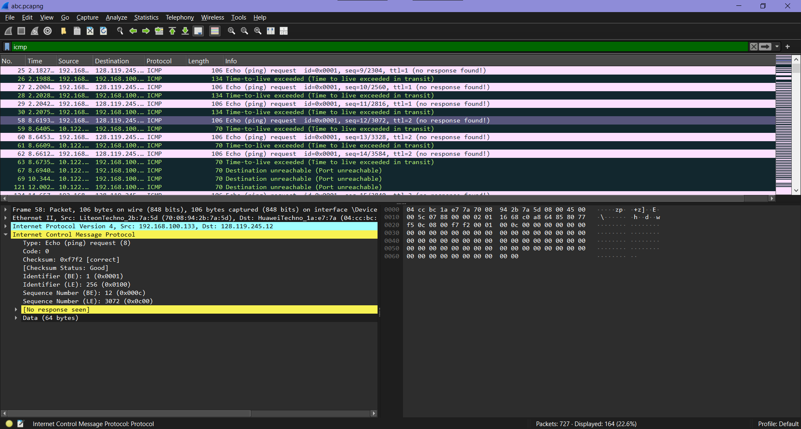
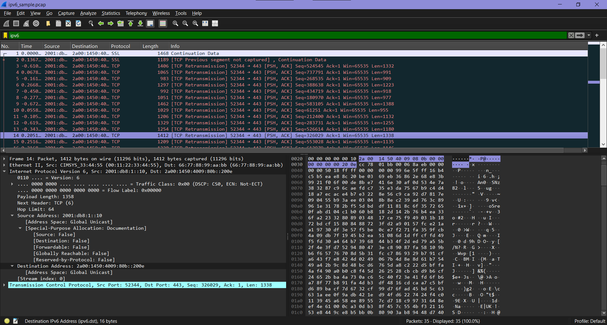

# LAPORAN WEEK 10

# Menangkap paket dari eksekusi traceroute
Traceroute digunakan untuk melacak jalur pengiriman datagram IPv4 dengan cara mengirim paket menggunakan nilai Time-To-Live (TTL) yang berbeda secara bertahap. Program ini mula-mula mengirim datagram dengan TTL = 1, kemudian TTL = 2, TTL = 3, dan seterusnya menuju tujuan yang sama. Setiap router yang menerima datagram akan mengurangi nilai TTL sebesar 1. Jika nilai TTL mencapai 0, router akan mengirimkan pesan ICMP tipe 11 (TTL Exceeded) kembali ke pengirim. Dengan mekanisme ini, traceroute dapat mengetahui alamat IP setiap router yang dilewati berdasarkan alamat sumber pada pesan ICMP yang diterima, sehingga jalur antara host pengirim dan tujuan dapat dipetakan.

## Bagian 1: IPv4
Pada gambar dibawah ini memperlihatkan paket IPv4 di Wireshark ketika dilakukan proses traceroute atau ping. Dari hasil tersebut dapat dilihat bagaimana paket ICMP dikirim dengan nilai TTL (Time To Live) yang berbeda-beda untuk mengetahui jalur router yang dilewati menuju alamat IP tujuan `128.119.245.12`.
Pada pengiriman pertama, komputer dengan alamat IP `192.168.100.133` mengirim paket ICMP Echo Request dengan nilai TTL = 1. Karena setiap router akan mengurangi nilai TTL sebanyak 1, maka paket langsung berhenti di router pertama karena nilai TTL menjadi 0. Router tersebut kemudian mengirim balasan berupa pesan ICMP “Time Exceeded” yang menandakan bahwa masa hidup paket telah habis di perjalanan. Balasan ini terlihat berasal dari alamat IP `10.122.19.120`.
Setelah itu, sistem kembali mengirim paket dengan nilai TTL = 2. Paket kali ini berhasil melewati router pertama, tetapi berhenti di router kedua karena nilai TTL kembali habis. Router kedua lalu mengirim pesan ICMP Time Exceeded ke pengirim. Proses ini dilakukan terus-menerus dengan menambah nilai TTL secara bertahap sehingga setiap router atau hop yang dilewati dapat diketahui hingga paket mencapai tujuan akhir

## Bagian 2 : IPv6
Gambar tersebut memperlihatkan hasil penangkapan paket jaringan IPv6 menggunakan Wireshark. Pada capture terlihat beberapa paket TCP yang dikirim dari alamat IPv6 `2001:db8::1b` menuju alamat `2400:1450:4000:80b::2004`. Paket tersebut menggunakan port tujuan `443`, sehingga dapat diketahui bahwa komunikasi dilakukan melalui layanan HTTPS atau koneksi web yang aman. Di daftar paket juga terlihat banyak keterangan **TCP Retransmission**. Kondisi ini menandakan bahwa beberapa paket harus dikirim ulang karena sebelumnya belum menerima balasan atau acknowledgment dari penerima. Hal tersebut umumnya terjadi akibat jaringan yang mengalami keterlambatan, packet loss, atau koneksi yang kurang stabil selama proses komunikasi berlangsung.
