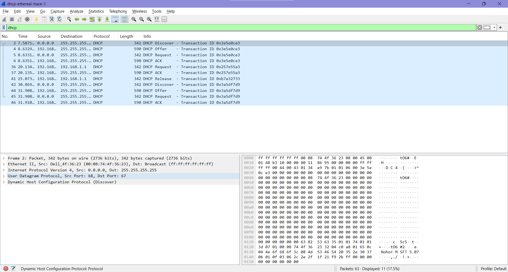

# Laporan week 11 (DHCP)

## Apa itu DHCP?
DHCP adalag sebuah protokol jaringan yang berfungsi memberikan alamat IP secara otomatis kepada perangkat yang terhubung ke jaringan. Dengan DHCP, perangkat seperti laptop,hp, atau komputer tidak perlu mengatur alamat IP secara manual karena server DHCP akan secara otomatis memberikan pengaturan jaringan.

Pada gambar diatas menunjukkan proses komunikasi DHCP (Dynamic Host Configuration Protocol) dalam pemberian alamat IP secara otomatis kepada perangkat client di jaringan. Ada beberapa jenis paket DHCP seperti DHCP Discover, DHCP Offer, DHCP Request, dan DHCP ACK. Proses dimulai saat client yang belum memiliki alamat IP mengirim paket DHCP Discover dari alamat 0.0.0.0 ke alamat broadcast 255.255.255.255 untuk mencari server DHCP. Selanjutnya server DHCP dengan alamat 192.168.1.1 merespons menggunakan DHCP Offer dengan menawarkan alamat IP kepada client. 

Setelah itu client mengirim DHCP Request dengan memakai IP yang ditawarkan, lalu server membalas dengan DHCP ACK untuk mengonfirmasi kalau alamat IP tersebut resmi diberikan kepada client. Pada gambar diatas juga terlihat DHCP Release yang menandakan client melepaskan alamat IP sebelumnya sebelum melakukan proses permintaan IP kembali. Dari hasil ini dapat disimpulkan bahwa kalau bekerja secara otomatis untuk mengatur konfigurasi jaringan sehingga perangkat dapat terhubung ke jaringan tanpa pengaturan IP manual.