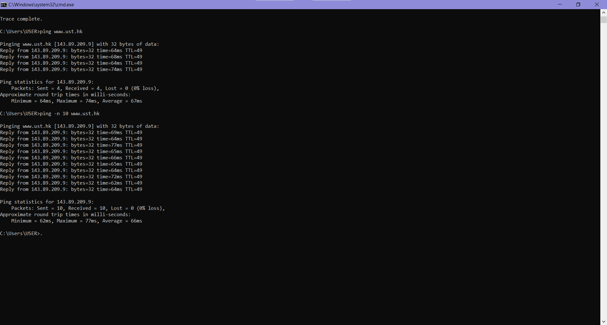
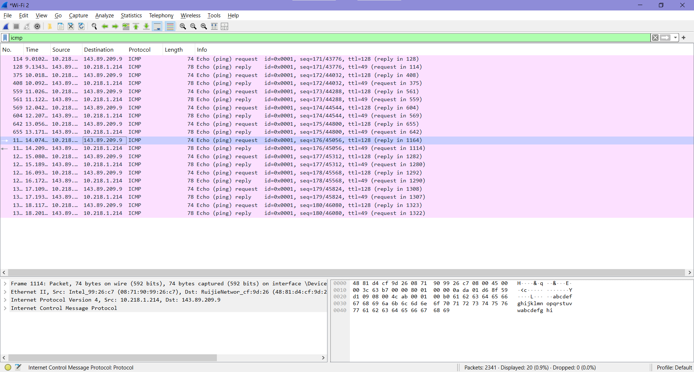
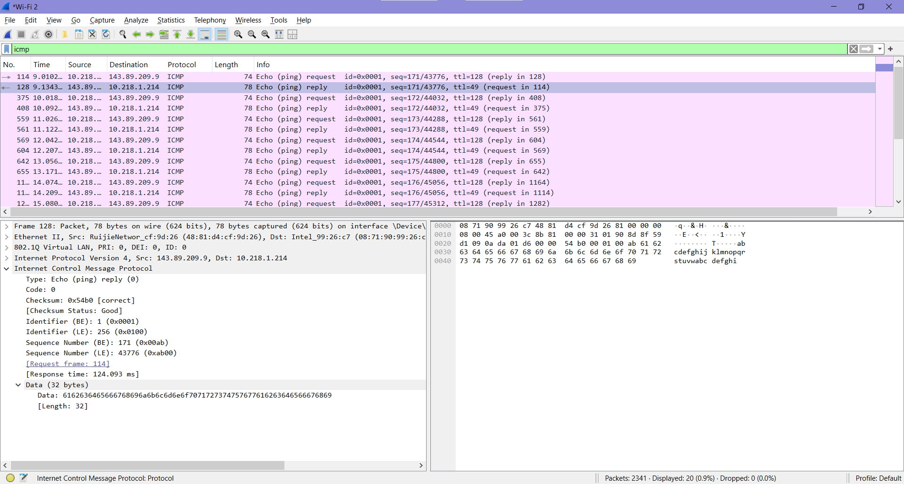
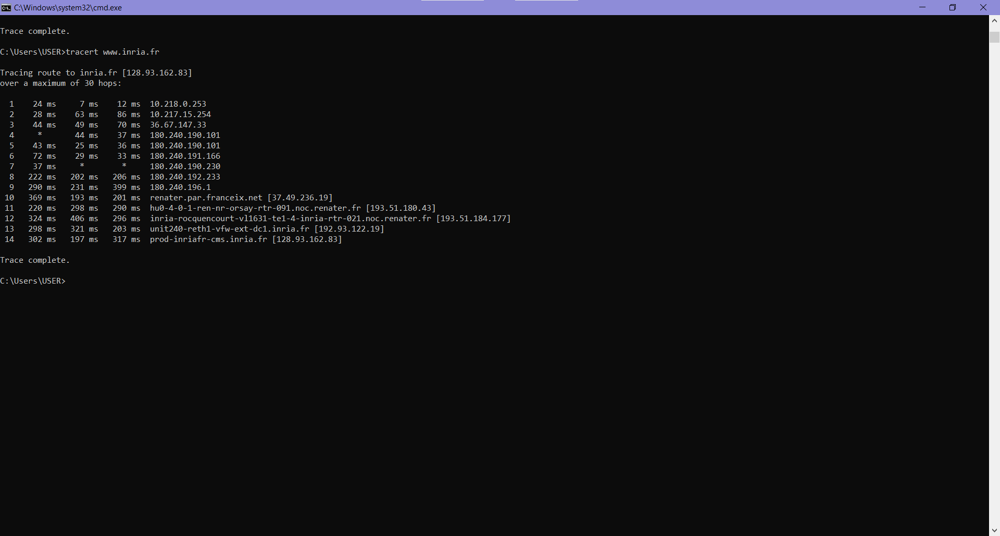
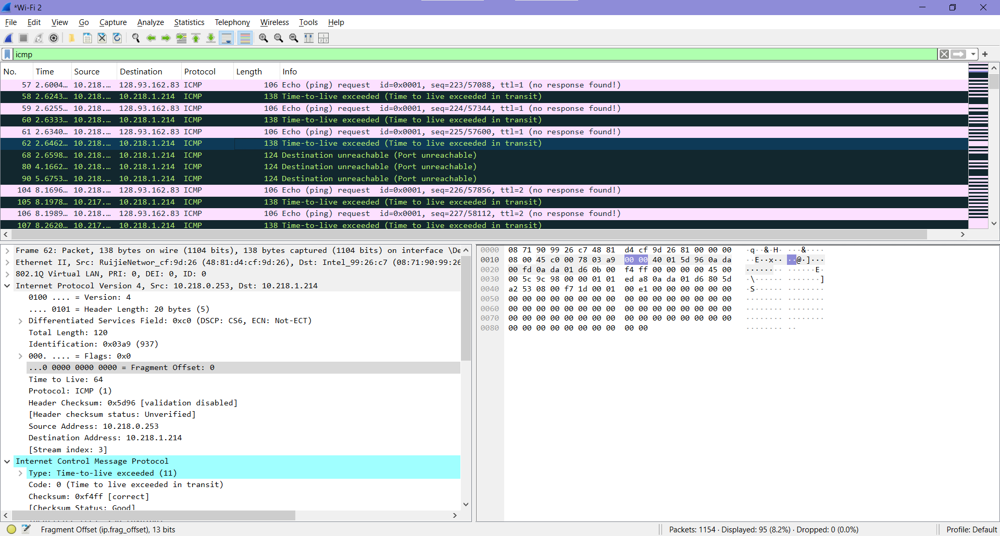

# LAPORAN PRAKTIKUM MODUL 12
## ICMP dan Ping
ICMP adalah protokol jaringan yang berfungsi untuk kontrol dan pelaporan kesalahan dalam komunikasi data. Salah satu implementasi ICMP adalah PING, yaitu alat untuk mengecek koneksi dan respon jaringan antar perangkat.PING bekerja dengan mengirim pesan ICMP Echo Request dan menerima Echo Reply dari tujuan. Karena itu, ICMP dan PING sangat penting dalam administrasi serta troubleshooting jaringan komputer.

### Implementasi ICMP dan Ping
Buka cmd/powershell lalu ketikkan ping -n 10 www.ust.hk untuk menguji koneksi jaringan menuju server www.ust.hk dengan mengirim 10 paket ICMP. Dari hasil ping dapat diketahui apakah server dapat diakses, seberapa cepat respons jaringan, serta kestabilan koneksi internet yang digunakan.

Lalu buka wireshark dan filter ICMP seperti gambar dibawah ini.

Berdasarkan tangkapan layar Wireshark di atas, terlihat proses komunikasi menggunakan protokol ICMP antara host 10.218.1.214 dan server 143.89.209.9. Paket yang ditampilkan berupa ICMP Echo Request dan Echo Reply yang merupakan hasil dari perintah ping. Pada Frame 114 terlihat paket ICMP Type 8 Code 0 atau Echo Request yang dikirim dari alamat IP 10.218.1.214 menuju 143.89.209.9. Paket tersebut memiliki nilai TTL sebesar 128 dengan panjang data (payload) sebesar 32 bytes. Setelah paket request dikirim, server memberikan balasan berupa ICMP Echo Reply sebagai tanda bahwa host tujuan dapat dihubungi dengan baik.

Selain itu, jumlah paket yang muncul sebanyak 20 paket terjadi karena penggunaan parameter `-n 10` pada perintah ping. Parameter tersebut membuat komputer mengirimkan 10 paket request, dan setiap request memperoleh 1 reply dari server tujuan, sehingga total paket yang tercatat menjadi 20 paket.

## Traceroute
Apa itu tracerouter ? Traceroute merupakan sebuah teknik atau utilitas jaringan yang digunakan untuk mengetahui jalur yang dilalui paket data dari komputer sumber menuju host tujuan. Perintah ini menampilkan setiap router atau hop yang dilewati selama proses pengiriman data berlangsung.

Cara kerja traceroute berbeda pada masing-masing sistem operasi. Pada sistem Unix/Linux/MacOS, traceroute umumnya menggunakan paket UDP dengan nomor port tujuan tertentu yang jarang digunakan. Sementara itu, pada sistem operasi Windows, traceroute menggunakan paket ICMP.

Traceroute bekerja dengan mengirim paket secara bertahap menggunakan nilai TTL (Time To Live) yang terus meningkat, dimulai dari TTL = 1, TTL = 2, dan seterusnya. Setiap router yang dilewati akan mengurangi nilai TTL sebesar satu. Ketika nilai TTL mencapai nol atau satu, router akan mengirimkan pesan ICMP error kembali ke pengirim. Melalui mekanisme tersebut, traceroute dapat menampilkan daftar hop atau jalur yang dilalui paket hingga mencapai tujuan akhir.

### Implementasi Traceroute
Buka cmd/powershell lalu ketikkan tracert www.inria.fr untuk melacak jalur perjalanan paket data dari komputer pengguna menuju server www.inria.fr. Perintah ini membantu pengguna mengetahui router atau hop yang dilewati paket selama proses pengiriman data di jaringan internet.

Lalu buka wireshark dan filter ICMP seperti gambar dibawah ini.

Berdasarkan gambar diatas komputer dengan alamat IP 10.218.1.214 mengirimkan paket ICMP Echo Request ke alamat tujuan 128.93.162.83 dengan nilai TTL = 1. Karena nilai TTL habis pada router pertama, router mengirim balasan berupa pesan ICMP “Time-to-live exceeded in transit”. Hal ini menunjukkan hop pertama pada jalur jaringan.

Selanjutnya, sistem kembali mengirim paket dengan nilai TTL yang lebih besar, seperti TTL = 2 dan seterusnya. Setiap kali TTL habis di router tertentu, router tersebut mengirim pesan ICMP Time Exceeded sehingga traceroute dapat mengetahui jalur yang dilewati paket data. Dapat disimpulkan bahwa perintah `tracert www.inria.fr` berhasil digunakan untuk mengetahui hop atau router yang dilalui paket data dari komputer pengguna menuju server tujuan beserta respons jaringan pada setiap hop.

### Kesimpulan
Berdasarkan percobaan yang dilakukan, protokol ICMP digunakan untuk membantu pengecekan dan analisis jaringan komputer. Perintah ping digunakan untuk mengetahui koneksi dan kecepatan respons server, sedangkan tracert digunakan untuk melacak jalur atau hop yang dilewati paket data menuju tujuan. Dari hasil pengujian, koneksi jaringan berhasil berjalan dengan baik dan paket ICMP dapat dianalisis menggunakan Wireshark.