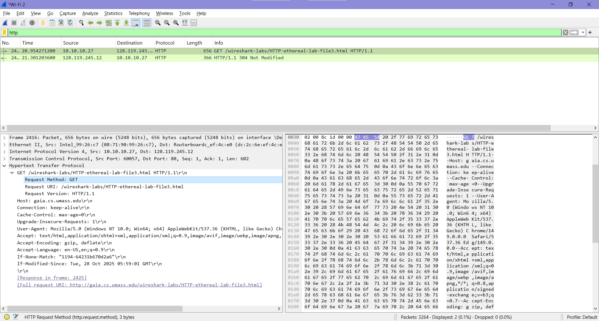
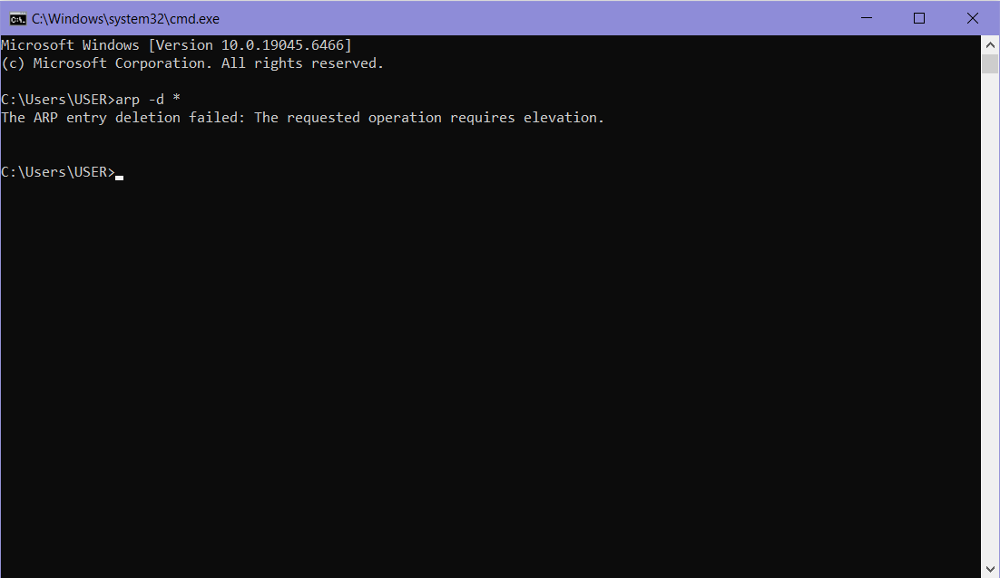
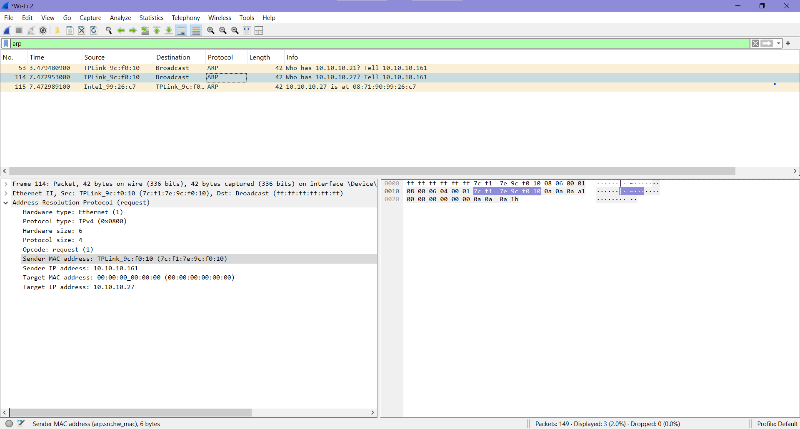

# Laporan week 13 (Ethernet and ARP)

## Menangkap dan menganalisis frame Ethernet
Langkah pertama, bersihkan dahulu cache pada browser Anda. Jika menggunakan Mozilla Firefox V3, buka menu Tools -> Clear Recent History, lalu centang opsi Cache. Bagi pengguna Internet Explorer, silakan akses Tools -> Internet Options, lalu pilih Delete Files. Setelah itu, jalankan aplikasi Wireshark untuk mulai menangkap paket. Akses tautan berikut http://gaia.cs.umass.edu/wireshark-labs/HTTP-ethereal-lab-file3.html Jika halaman sudah terbuka sepenuhnya, hentikan proses penangkapan paket di Wireshark.

Terakhir, cari nomor paket pada kolom paling kiri di jendela Wireshark bagian atas. Temukan baris yang menunjukkan pesan HTTP GET dari komputer Anda menuju gaia.cs.umass.edu, serta paket respons balik dari server tersebut ke komputer Anda (sebagai contoh, pesan HTTP GET bisa dilihat pada paket nomor 4).

image_2737bd.png, proses pertukaran data HTTP telah berhasil difilter dan dianalisis. Komputer klien yang memiliki IP lokal 10.10.10.27 melakukan pengiriman permintaan dokumen ke server target gaia.cs.umass.edu yang berada pada IP 128.119.245.12.

Aktivitas ini diawali dengan dikirimkannya pesan HTTP GET oleh komputer klien melalui paket nomor 2416. Di dalam detail paket tersebut, terlihat jelas bahwa metode permintaan yang digunakan adalah GET dengan tujuan URI /wireshark-labs/HTTP-ethereal-lab-file3.html. Paket permintaan ini juga membawa informasi User-Agent berupa spesifikasi browser dan sistem operasi yang digunakan klien, serta baris perintah If-Modified-Since untuk melakukan validasi dokumen terhadap cache lokal.

Sebagai tanggapan dari permintaan tersebut, server mengirimkan pesan respons balik yang tercatat pada paket nomor 2425. Server memberikan status berupa HTTP/1.1 304 Not Modified. Kode status ini menandakan bahwa dokumen Bill of Rights yang diminta oleh klien tidak mengalami perubahan data di sisi server sejak terakhir kali diakses, sehingga browser klien diarahkan untuk memuat kembali dokumen yang sudah tersimpan di dalam memori cache mereka sendiri.

##  Address Resolution Protocol (ARP)
### Caching ARP
ARP Caching (atau sering disebut ARP Table/ARP Cache) adalah sebuah mekanisme penyimpanan sementara yang digunakan oleh perangkat jaringan (seperti komputer, laptop, atau router) untuk mengingat "alamat IP" dan "Mac Address" (alamat fisik) dari perangkat lain yang berada di dalam satu jaringan yang sama.
1. Pembersihan Cache ARP:
* Sistem Operasi Windows (MS-DOS): Jalankan perintah arp -d * untuk menghapus seluruh entri yang tersimpan di dalam tabel ARP (tanda * berfungsi sebagai wildcard).
* Sistem Operasi Linux/Unix/MacOS: Eksekusi perintah arp -d * dengan memastikan Anda memiliki hak akses administrator (root).

2. Inisiasi Pengamatan ARP: 
* Pastikan cache pada browser telah dibersihkan sepenuhnya, lalu jalankan aplikasi Wireshark untuk memulai perekaman aktivitas jaringan.
* Akses URL berikut melalui browser Anda: [http://gaia.cs.umass.edu/wireshark-labs/HTTP-ethereal-lab-file3.html](http://gaia.cs.umass.edu/wireshark-labs/HTTP-ethereal-lab-file3.html).
- Setelah halaman selesai dimuat, segera hentikan proses penangkapan paket (stop packet capture) pada Wireshark.
3. Filtering: 
* Masuk ke menu Analyze $\rightarrow$ Enabled Protocols, kemudian hilangkan tanda centang pada protokol IP, lalu klik OK. Langkah ini dilakukan untuk menyembunyikan paket lain yang tidak diperlukan agar analisis berfokus pada ARP.
* Ketik kata kunci arp pada kolom display filter Wireshark, lalu tekan Enter untuk menampilkan aktivitas protokol ARP saja.c

Berdasarkan hasil analisis paket pada image_26bfbc.png, protokol ARP bekerja melalui dua tahapan utama, yaitu *Request* (permintaan) dan *Reply* (jawaban). 

Aktivitas pengamatan diawali pada paket nomor 114, di mana perangkat dengan IP `10.10.10.161` mengirimkan pesan *ARP Request* bermetode *Broadcast* (`Dst: Broadcast`) ke seluruh jaringan. Pesan tersebut bertujuan untuk mencari pemilik IP `10.10.10.27`. Pada detail struktur protokol ARP paket ini, nilai *Opcode* tercatat sebagai `request (1)` dengan *Target MAC address* yang masih bernilai kosong (`00:00:00_00:00:00`) karena alamat fisik target belum diketahui.

Selanjutnya pada paket nomor 115, komputer target dengan IP `10.10.10.27` mengirimkan pesan *ARP Reply* secara *Unicast* langsung ke perangkat peminta. Pesan ini mengonfirmasi bahwa IP `10.10.10.27` berasosiasi dengan MAC Address `08:71:90:99:26:c7` (Intel_99:26:c7). Dengan demikian, kedua perangkat kini telah memperbarui tabel *ARP Cache* masing-masing dan siap melakukan komunikasi data.