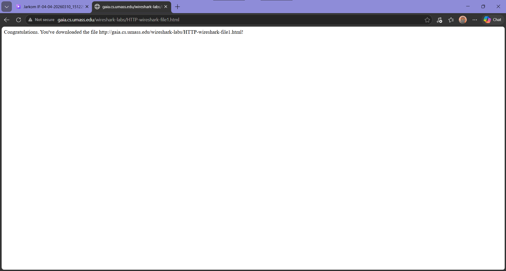
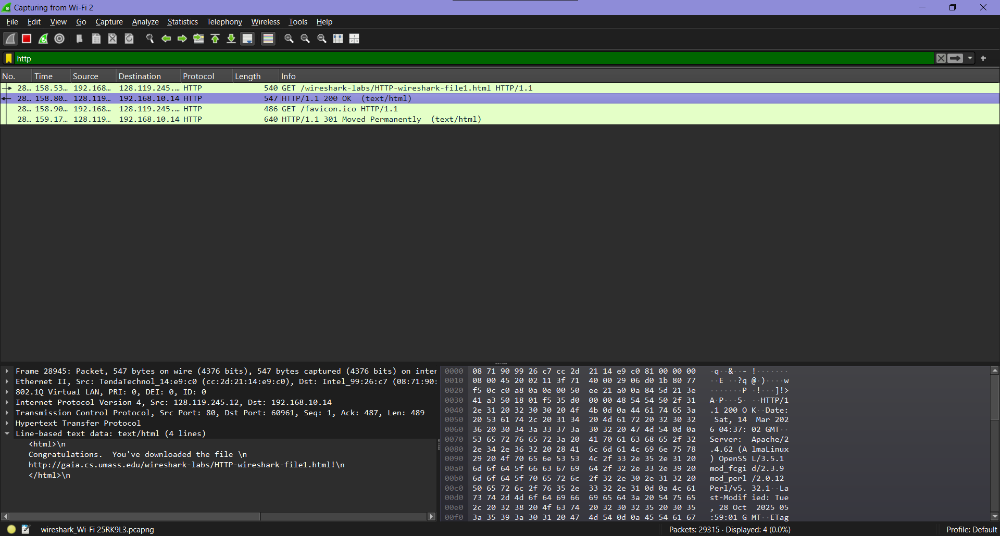
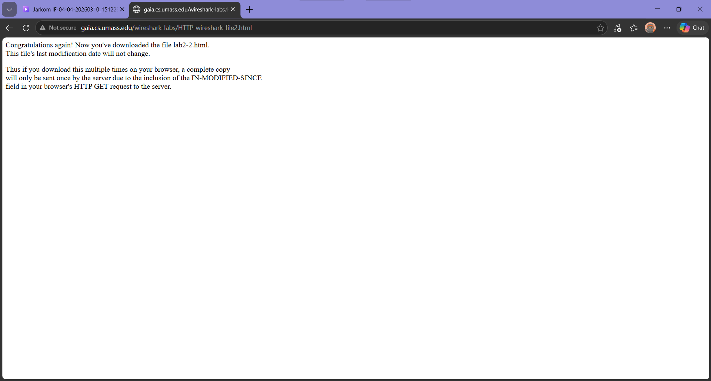
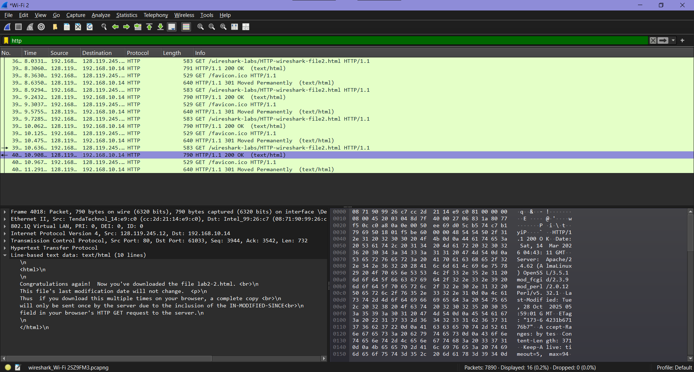
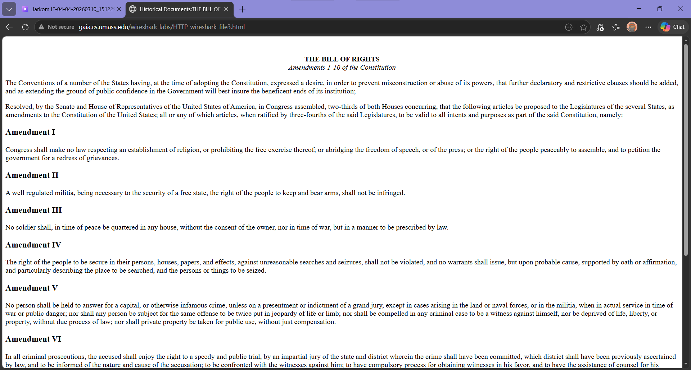
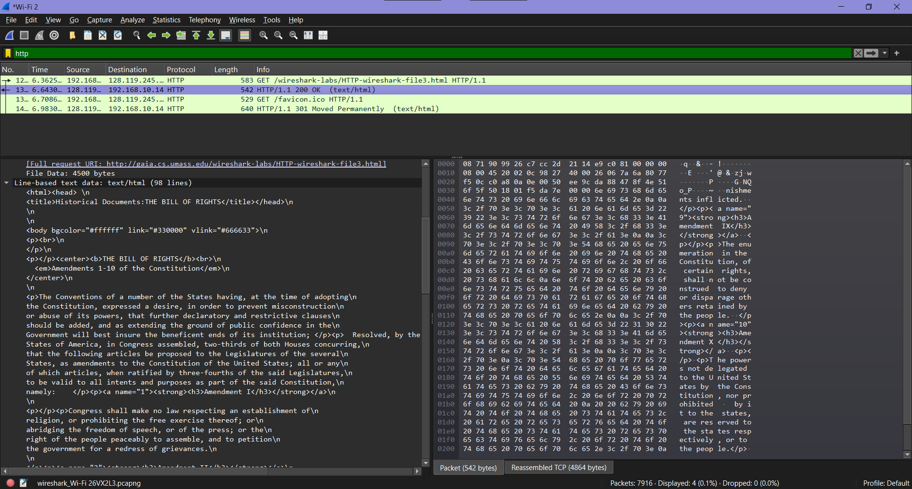
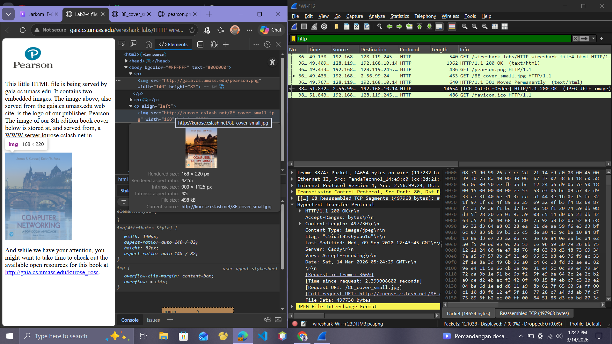
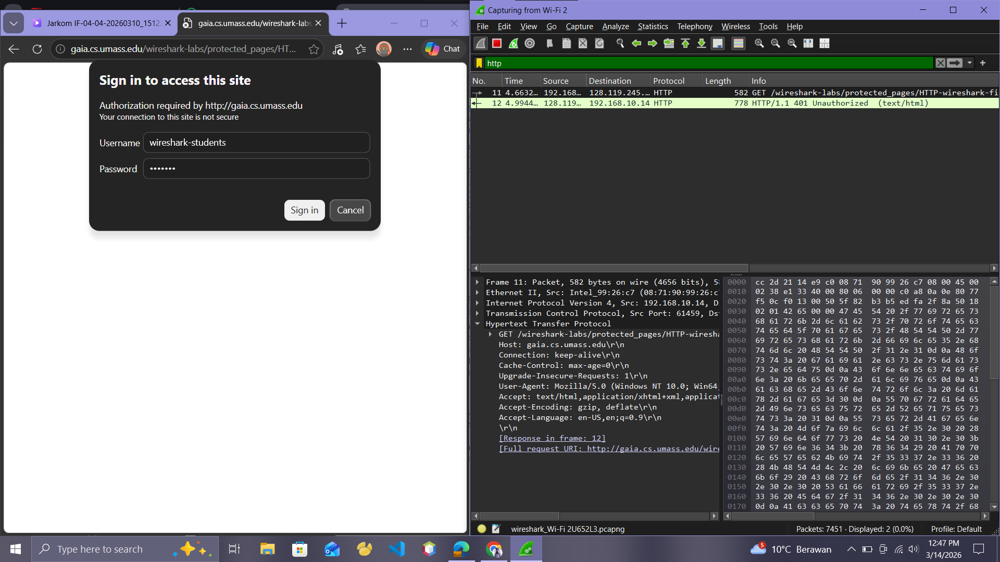
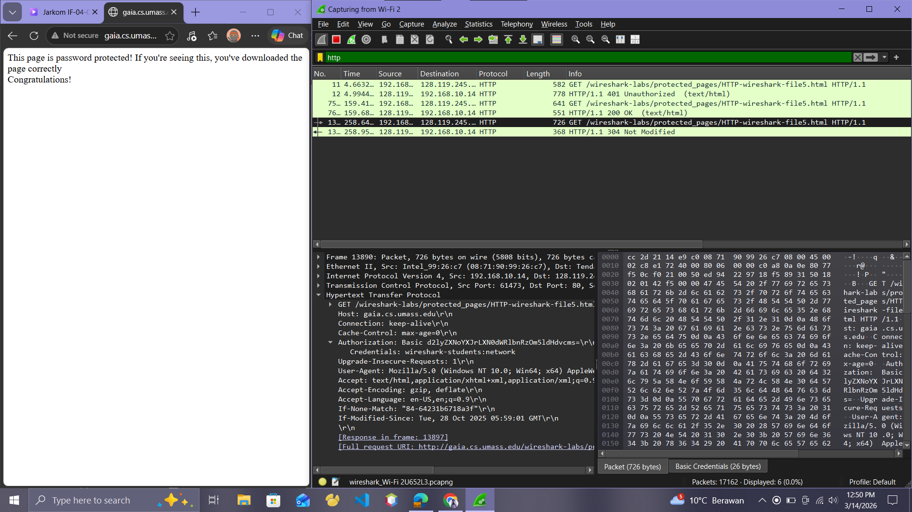

# Laporan Modul 3

Pada modul kali ini saya akan mempraktikan beberapa aspek dari protokol HTTP (Hypertext Transfer Protocol).Beberapa hal yang akan diamati antara lain interaksi dasar antara metode GET dan response, format pesan HTTP, proses pengambilan file HTML berukuran besar, pengambilan file HTML yang memiliki objek tertanam (embedded objects), serta mekanisme autentikasi dan keamanan pada HTTP.

## Basic HTTP GET/response interaction
Untuk memulai eksplorasi terhadap protokol HTTP, pertama bisa mengakses sebuah file HTML yang sangat sederhana. File tersebut berukuran kecil dan tidak memiliki objek yang disematkan (embedded objects). Langkah-langkah yang dilakukan dalam percobaan ini adalah sebagai berikut:

1. Membuka web browser yang akan digunakan untuk mengakses halaman web.
2. Mengakses alamat berikut melalui browser: http://gaia.cs.umass.edu/wireshark-labs/HTTP-wireshark-file1.html. ingat harus berupa HTTP nanti akan muncul seperti gambar dibawah ini.

3. Setelah halaman berhasil ditampilkan, proses pengambilan paket pada Wireshark dihentikan.

Pada jendela packet list, terlihat dua pesan HTTP yang dapat dilihat oleh Wireshark, yaitu GET request dari browser ke server gaia.cs.umass.edu dan response dari server ke browser. Jendela packet details menampilkan rincian pesan yang dipilih. Karena HTTP dikirim melalui TCP, IP, dan Ethernet, Wireshark juga menampilkan informasi dari layer tersebut.

## HTTP CONDITIONAL GET/response interaction
1. Pertama, jalankan browser dan pastikan cache serta history browser sudah dibersihkan. Selanjutnya, mulai jalankan kembali capture di Wireshark.

2. Masukkan URL http://gaia.cs.umass.edu/wireshark-labs/HTTP-wireshark-file2.html pada browser hingga halaman HTML sederhana yang berisi lima baris ditampilkan. Setelah itu, akses kembali URL yang sama dengan cepat atau tekan tombol refresh pada browser.

3. Setelah proses selesai, hentikan pengambilan paket pada Wireshark dan masukkan filter http pada kolom display filter agar hanya paket HTTP yang ditampilkan pada daftar paket.

##  Retrieving Long Documents
Pada percobaan melakukan pengamatan terhadap proses pengambilan file HTML berukuran besar menggunakan Wireshark.

1. Pertama, browser dijalankan dan cache serta history dibersihkan. 
2. Selanjutnya proses packet capture dimulai menggunakan Wireshark. Kemudian pengguna mengakses URL http://gaia.cs.umass.edu/wireshark-labs/HTTP-wireshark-file3.html, sehingga browser menampilkan halaman Bill of Rights Amerika Serikat yang berukuran cukup panjang. 

3. Setelah halaman berhasil dimuat, proses penangkapan paket dihentikan dan filter http diterapkan agar hanya paket HTTP yang ditampilkan.

Pada packet list terlihat pesan HTTP GET diikuti oleh respons dari server yang terdiri dari beberapa segmen TCP. Hal ini terjadi karena ukuran file HTML sekitar 4500 byte, sehingga tidak dapat dimuat dalam satu paket TCP. Oleh karena itu, data dikirim dalam beberapa segmen TCP yang kemudian direkonstruksi kembali oleh Wireshark, yang ditandai dengan keterangan “TCP segment of a reassembled PDU” pada kolom Info.

##  HTML Documents dengan Embedded Objects
Selanjutnya mencoba proses pengambilan file HTML yang memiliki objek tertanam (embedded objects) menggunakan Wireshark.

1. Pertama, browser dijalankan dan cache serta history dibersihkan. Setelah itu, proses packet capture dimulai menggunakan Wireshark.
2. Selanjutnya pengguna mengakses URL http://gaia.cs.umass.edu/wireshark-labs/HTTP-wireshark-file4.html. Halaman yang ditampilkan berupa file HTML pendek yang memuat dua gambar. Gambar tersebut tidak berada langsung di dalam file HTML, melainkan direferensikan melalui URL sehingga browser harus mengambilnya dari server yang bersangkutan, yaitu situs gaia.cs.umass.edu.
3. Setelah halaman dimuat, proses penangkapan paket dihentikan dan filter http diterapkan agar hanya paket HTTP yang ditampilkan pada daftar paket di Wireshark.

Berdasarkan hasil pengamatan gambar diatas dapat disimpulkan bahwa ketika sebuah halaman HTML memiliki objek yang disematkan (embedded objects) seperti gambar, browser tidak hanya mengambil file HTML utama saja. Browser juga akan mengirimkan request HTTP tambahan untuk setiap objek yang direferensikan dalam halaman tersebut.Setiap objek tersebut diambil melalui HTTP GET request yang terpisah dan server akan memberikan HTTP response sesuai dengan jenis file yang diminta.Lalu melakukan inspect pada halaman browser untuk mengetahui sumber dari gambar yang dimuat dalam halaman tersebut

## HTTP Authentication
Selanjutnya akan mencoba mengamati pertukaran pesan HTTP pada halaman yang dilindungi kata sandi menggunakan Wireshark.

1. Langkah pertama adalah menjalankan browser web dan memastikan cache serta history telah dibersihkan. Setelah itu, proses packet capture dimulai menggunakan Wireshark.

2. Selanjutnya, mengakses URL http://gaia.cs.umass.edu/wireshark-labs/protected_pages/HTTP-wireshark-file5.html. Ketika halaman diakses, browser akan menampilkan pop-up autentikasi yang meminta username dan password. Pengguna kemudian memasukkan username: wiresharkstudents dan password: network sesuai dengan yang telah ditentukan.

3. Setelah halaman berhasil diakses, proses penangkapan paket pada Wireshark dihentikan. Kemudian pada kolom display filter dimasukkan kata http agar hanya paket HTTP yang ditampilkan pada daftar paket.

...

## Bahaya HTTP

## Kesimpulan