# Laporan Praktikum modul 4

### Nslookup
1. Jalankan nslookup untuk mendapatkan alamat IP dari server web di Asia. Berapa alamat IP
server tersebut?
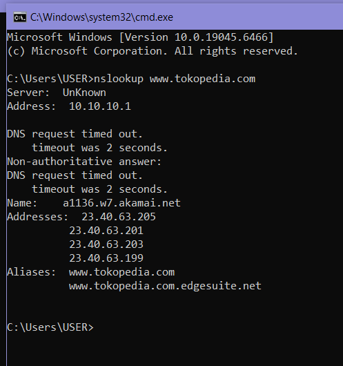
>jawaban:
 disini saya mencoba mencari ip dari website www.tokopedia.com dan IP yang dihasilkan adalah 23.40.63.199

______________________________________________________________________________________________________________
2.  Jalankan nslookup agar dapat mengetahui server DNS otoritatif untuk universitas di Eropa.
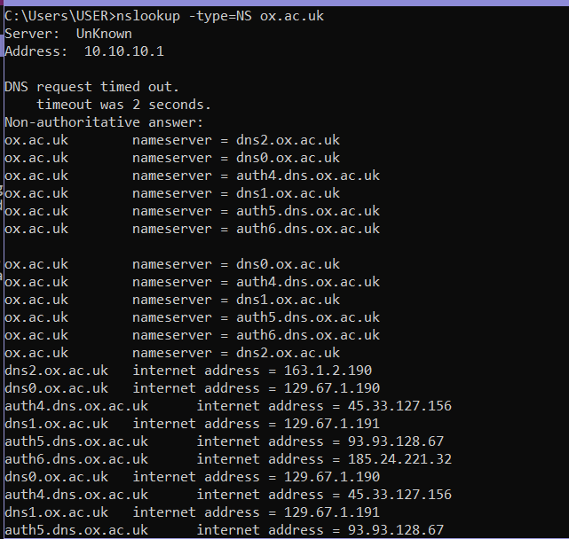
>jawaban :hasil server dns otoritatif dari universitas Oxford terdapat pada gambar diatas.
_______________________________________________________________________________________________________________
3. Jalankan nslookup untuk mencari tahu informasi mengenai server email dari Yahoo! Mail
melalui salah satu server yang didapatkan di pertanyaan nomor 2. Apa alamat IP-nya?
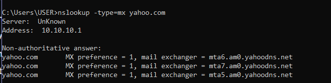
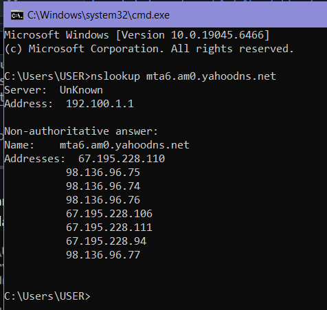
>jawaban :berdasarkan hasil nslookup, server email Yahoo adalah mta6.am0.yahoodns.net. Setelah dilakukan lookup lanjutan, diperoleh alamat IP yaitu 67.195.204.77.

### Tracing DNS dengan Wireshark
Selanjutnya, jawab beberapa pertanyaan berikut:
1. Cari pesan permintaan DNS dan balasannya. Apakah pesan tersebut dikirimkan melalui UDP
atau TCP?
>jawab :
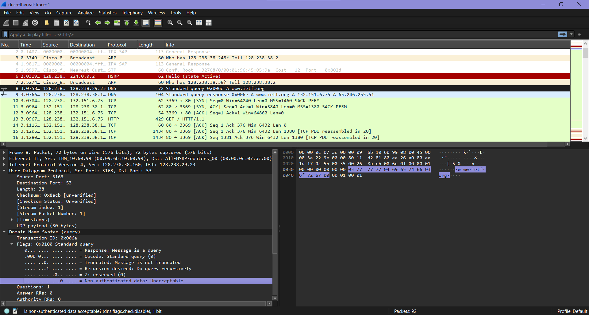
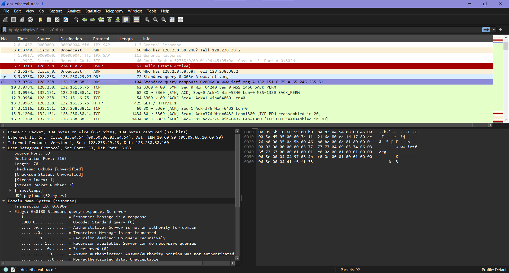

_______________________________________________________________________________________________________________
2. Apa port tujuan pada pesan permintaan DNS? Apa port sumber pada pesan balasannya?
>jawab :Port tujuan pada pesan permintaan adalah 53 dan untuk port sumber pada pesan balasannya sama 53. 
_______________________________________________________________________________________________________________
3. Pada pesan permintaan DNS, apa alamat IP tujuannya? Apa alamat IP server DNS lokal anda
(gunakan ipconfig untuk mencari tahu)? Apakah kedua alamat IP tersebut sama?
>jawab :Alamat IP tujuan pada permintaan DNS tidak sama dengan IP server DNS lokal saya
_______________________________________________________________________________________________________________
4. Periksa pesan permintaan DNS. Apa “jenis” atau ”type” dari pesan tersebut? Apakah pesan
permintaan tersebut mengandung ”jawaban” atau ”answers”?
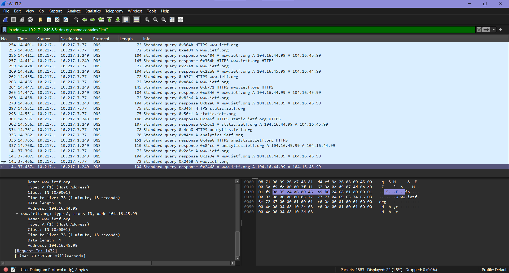
>jawab :Pesan permintaan DNS bertipe A dan tidak berisi jawaban karena bagian jawaban hanya akan diisi ketika memberikan balasan.
_______________________________________________________________________________________________________________
5. Periksa pesan balasan DNS. Berapa banyak ”jawaban” atau ”answers” yang terdapat di
dalamnya? Apa saja isi yang terkandung dalam setiap jawaban tersebut?
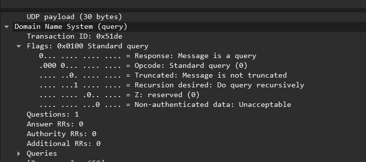
>jawab :Jumlah “answers” pada pesan tersebut adalah 0. Hal ini karena paket yang dianalisis merupakan pesan permintaan (query), sehingga belum terdapat isi jawaban. Jawaban hanya akan muncul pada pesan balasan dari server DNS.
_______________________________________________________________________________________________________________
6. Perhatikan paket TCP SYN yang selanjutnya dikirimkan oleh host Anda. Apakah alamat IP
pada paket tersebut sesuai dengan alamat IP yang tertera pada pesan balasan DNS?
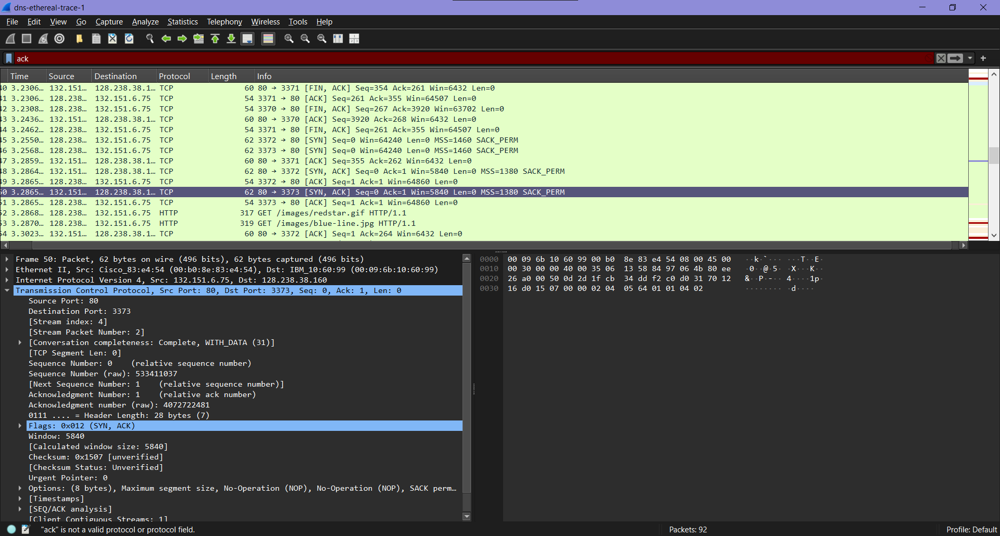
>jawab :Ya, alamat IP pada paket TCP SYN sesuai dengan alamat IP yang terdapat pada pesan balasan DNS. Hal ini karena host menggunakan hasil resolusi DNS sebagai tujuan untuk memulai koneksi TCP ke server.

_______________________________________________________________________________________________________________
7. Halaman web yang sebelumnya anda akses (http://www.ietf.org) memuat beberapa
gambar. Apakah host Anda perlu mengirimkan pesan permintaan DNS baru setiap kali ingin
mengakses suatu gambar?
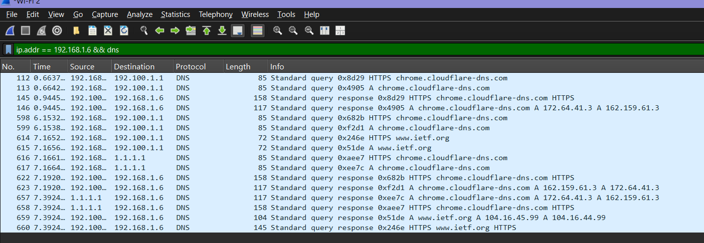
>jawab :Tidak, host tidak perlu melakukan query DNS baru untuk setiap gambar, kecuali: cache sudah kedaluwarsa, atau gambar berasal dari domain yang berbeda dan belum ada di cache.
_______________________________________________________________________________________________________________
### http://gaia.cs.umass.edu/wiresharklabs/wireshark-traces.zip

1. Apa port tujuan pada pesan permintaan DNS? Apa port sumber pada pesan balasan DNS?
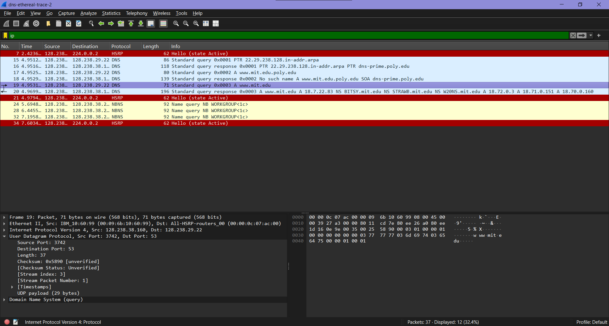
>jawab :Port tujuan pada pesan permintaan adalah 53 dan untuk port sumber pada pesan balasannya sama 53.

2. Ke alamat IP manakah pesan permintaan DNS dikirimkan? Apakah alamat IP tersebut
merupakan default alamat IP server DNS lokal Anda?

>jawab: ke port 53. ya, itu adalah DNS server lokal default di jaringan saya
_______________________________________________________________________________________________________________
3. Periksa pesan permintaan DNS. Apa ”jenis” atau ”type” dari pesan tersebut? Apakah pesan
tersebut mengandung ”jawaban” atau ”answers”?
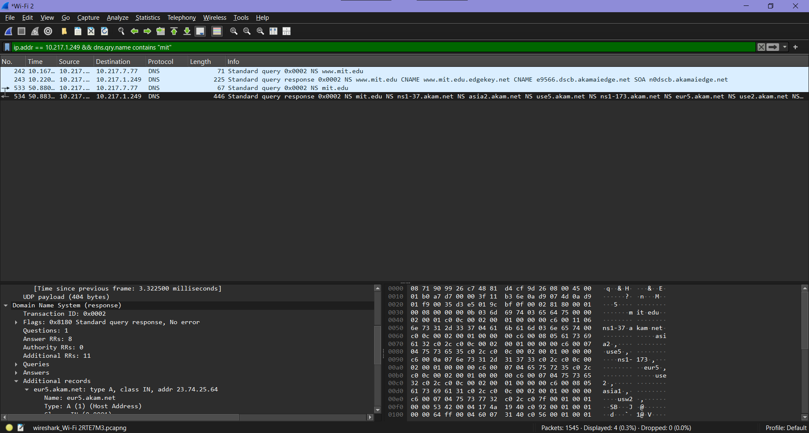
>jawab :Typenya A (IPv4 Address). Mengandung jawaban? Tidak, karena ini masih query, bukan response.
_______________________________________________________________________________________________________________
4. Periksa pesan balasan DNS. Berapa banyak ”jawaban” atau “answers” yang terdapat di
dalamnya. Apa saja isi yang terkandung dalam setiap jawaban tersebut?
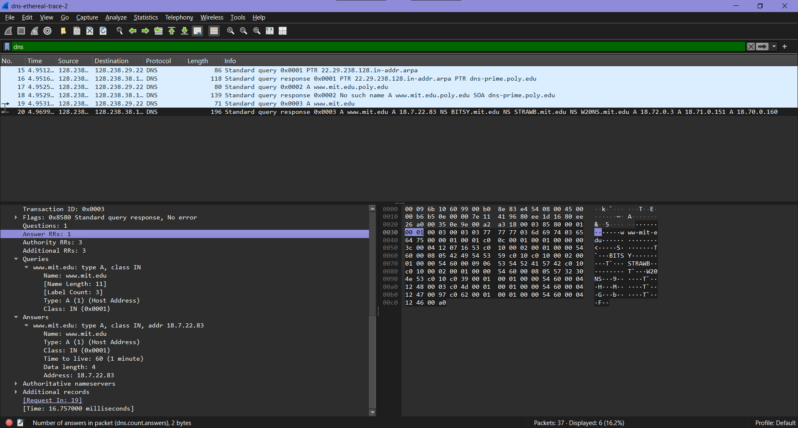
>jawab:pesan tersebut mengandung jawaban (answer) karena pada detail paket terlihat Answers RRs: 1, yang menunjukkan bahwa respons DNS sudah berisi alamat IP hasil permintaan.
_______________________________________________________________________________________________________________
### nslookup –type=NS mit.edu
1. Ke alamat IP manakah pesan permintaan DNS dikirimkan? Apakah alamat IP tersebut
merupakan default alamat IP server DNS lokal Anda?
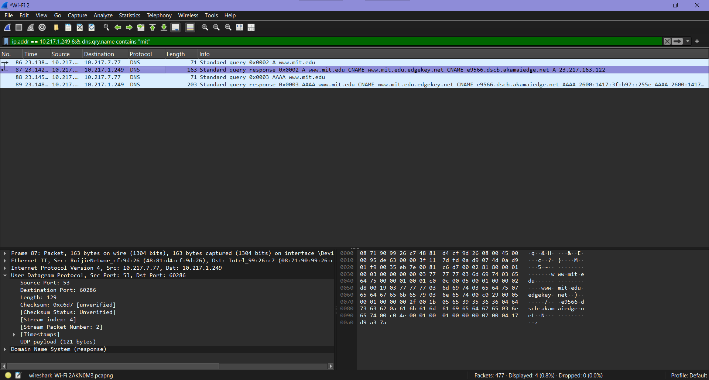
>jawab :dari tangkapan layar Wireshark, permintaan DNS dikirim ke 10.217.77.77. Alamat ini merupakan DNS server lokal/default yang digunakan host (terlihat dari kolom Destination pada paket DNS).
_______________________________________________________________________________________________________________
2. Periksa pesan permintaan DNS. Apa ”jenis” atau ”type” dari pesan tersebut? Apakah pesan
tersebut mengandung ”jawaban” atau ”answers”?

>jawab :
_______________________________________________________________________________________________________________
3. Periksa pesan balasan DNS. Apa nama server MIT yang diberikan oleh pesan balasan?
Apakah pesan balasan ini juga memberikan alamat IP untuk server MIT tersebut?
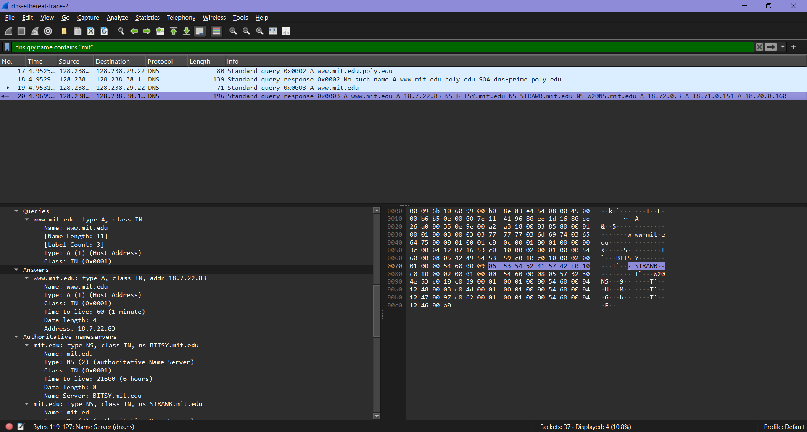
>jawab :

_______________________________________________________________________________________________________________
### nslookup www.aiit.or.kr bitsy.mit.edu
1. Ke alamat IP manakah pesan permintaan DNS dikirimkan? Apakah alamat IP tersebut
merupakan default alamat IP server DNS lokal Anda?
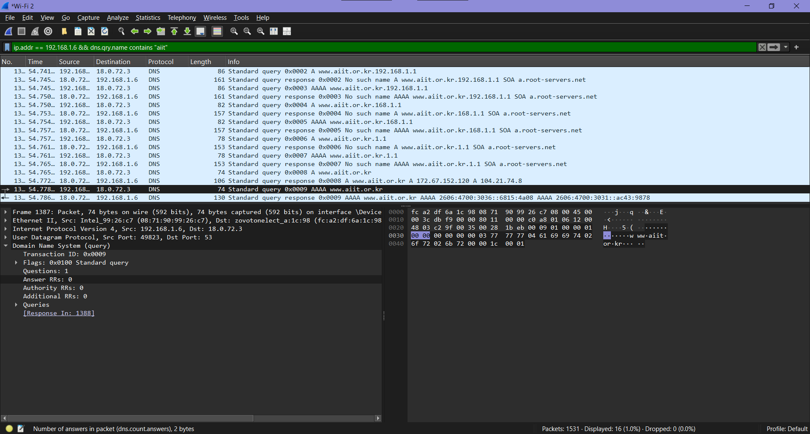
>jawab :

_______________________________________________________________________________________________________________
2. Periksa pesan permintaan DNS. Apa ”jenis” atau ”type” dari pesan tersebut? Apakah pesan
tersebut mengandung ”jawaban” atau ”answers”?
>jawab :

_______________________________________________________________________________________________________________
3. Periksa pesan balasan DNS. Berapa banyak ”jawaban” atau “answers” yang terdapat di
dalamnya. Apa saja isi yang terkandung dalam setiap jawaban tersebut?
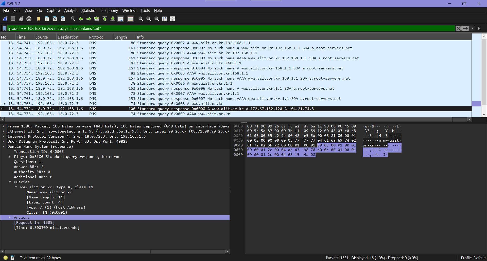
>jawab :

_______________________________________________________________________________________________________________