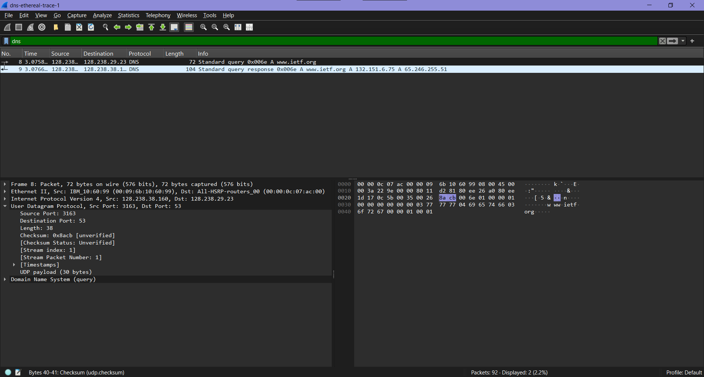

# Tugas Modul 5

1. Pilih satu paket UDP yang terdapat pada trace Anda. Dari paket tersebut, berapa banyak
“field” yang terdapat pada header UDP? Sebutkan nama-nama field yang Anda temukan!
>jawab :

>Pada trace yang dianalisis, dipilih satu paket UDP (DNS). Header UDP terdiri dari empat field utama, yaitu Source Port, Destination Port, Length, dan Checksum. Keempat field ini selalu ada pada setiap segmen UDP.
__________________________________________________________________________________________
2. Perhatikan informasi “content field” pada paket yang Anda pilih di pertanyaan 1. Berapa
panjang (dalam satuan byte) masing-masing “field” yang terdapat pada header UDP?
>jawab : Masing-masing field pada header UDP memiliki panjang yang tetap. Source Port memiliki panjang 2 byte, Destination Port sebesar 2 byte, Length sebesar 2 byte, dan Checksum juga 2 byte. Dengan demikian, total panjang header UDP adalah 8 byte, sesuai dengan desain UDP yang sederhana dan efisien.
__________________________________________________________________________________________
3. Nilai yang tertera pada ”Length” menyatakan nilai apa? Verfikasi jawaban Anda melalui
paket UDP pada trace.
>jawab :Nilai pada field Length menyatakan total panjang segmen UDP, yaitu gabungan antara header dan payload. Pada paket yang dianalisis, nilai Length adalah 38 byte, yang terdiri dari 8 byte header UDP dan 30 byte payload DNS, sehingga sesuai dengan konsep bahwa Length = header + data.
__________________________________________________________________________________________
4. Berapa jumlah maksimum byte yang dapat disertakan dalam payload UDP? (Petunjuk:
jawaban untuk pertanyaan ini dapat ditentukan dari jawaban Anda untuk pertanyaan 2)
>jawab :Karena field Length menggunakan 16 bit, maka nilai maksimum yang dapat direpresentasikan adalah 65535 byte. Dengan mengurangi ukuran header UDP (8 byte), maka ukuran maksimum payload UDP adalah 65527 byte.
__________________________________________________________________________________________
5. Berapa nomor port terbesar yang dapat menjadi port sumber? (Petunjuk: lihat petunjuk
pada pertanyaan 4)
>jawab :Nomor port pada UDP juga menggunakan 16 bit, sehingga nilai maksimum yang dapat digunakan sebagai port sumber adalah 65535. Rentang ini memungkinkan penggunaan port dari 0 hingga 65535, dengan beberapa port tertentu digunakan sebagai well-known port, seperti port 53 untuk DNS.
__________________________________________________________________________________________
6. Berapa nomor protokol untuk UDP? Berikan jawaban Anda dalam notasi heksadesimal dan
desimal. Untuk menjawab pertanyaan ini, Anda harus melihat ke bagian ”Protocol” pada
datagram IP yang mengandung segmen UDP.
>jawab :Nomor protokol UDP dapat dilihat pada field Protocol di header IP. UDP memiliki nilai 17 dalam desimal atau 0x11 dalam heksadesimal. Nilai ini menunjukkan bahwa data yang dibawa oleh IP adalah segmen UDP.
__________________________________________________________________________________________
7. Periksa pasangan paket UDP di mana host Anda mengirimkan paket UDP pertama dan paket
UDP kedua merupakan balasan dari paket UDP yang pertama. (Petunjuk: agar paket kedua merupakan balasan dari paket pertama, pengirim paket pertama harus menjadi tujuan dari
paket kedua). Jelaskan hubungan antara nomor port pada kedua paket tersebut!
>jawab :Pada pasangan paket UDP (request dan response), terdapat hubungan pada nomor port. Pada paket pertama (request), host menggunakan port sumber acak (misalnya 3163) dan mengirim ke port tujuan 53 (DNS). Pada paket balasan (response), server menggunakan port sumber 53 dan mengirim ke port tujuan 3163. Hal ini menunjukkan bahwa nomor port pada response merupakan kebalikan dari request, sehingga komunikasi dapat berlangsung dengan benar antara client dan server.
__________________________________________________________________________________________