# Jawaban Modul 6

## Jawablah pertanyaan-pertanyaan berikut dengan menganalisis paket yang tertangkap pada trace tcp- ethereal-trace-1.
1. Berapa alamat IP dan nomor port TCP yang digunakan oleh komputer klien (sumber) untuk
mentransfer file ke gaia.cs.umass.edu? Cara paling mudah menjawab pertanyaan ini adalah
dengan memilih sebuah pesan HTTP dan meneliti detail paket TCP yang digunakan untuk
membawa pesan HTTP tersebut.
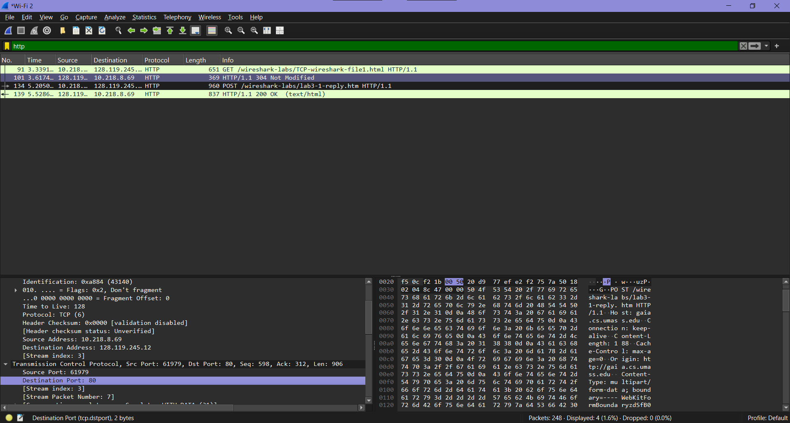
>jawab : Alamat IP klien (sumber): 10.218.8.69 dan Nomor port TCP klien: 61799
_____________________________________________________________________________________________________________________
2. Apa alamat IP dari gaia.cs.umass.edu? Pada nomor port berapa ia mengirim dan menerima
segmen TCP untuk koneksi ini?
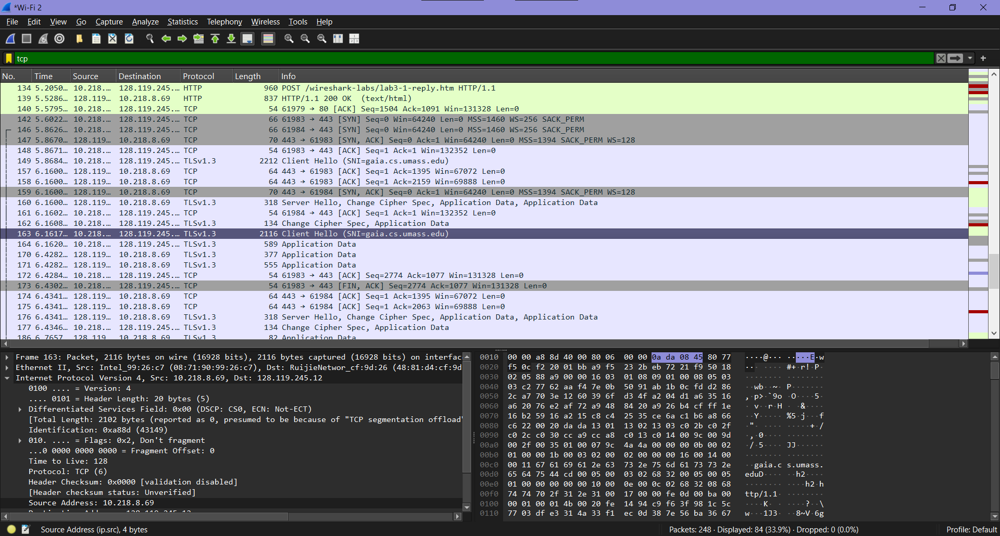
>jawab :Alamat IP dari gaia.cs.umass.edu yang terlihat pada hasil capture Wireshark adalah 128.119.245.12. Dalam koneksi TCP yang digunakan untuk komunikasi ini, server gaia.cs.umass.edu menggunakan port 80, yaitu port standar untuk layanan HTTP. Selama proses komunikasi berlangsung, server tersebut mengirimkan segmen TCP dari port 80 menuju port klien (port sementara/ephemeral), dan juga menerima segmen TCP pada port 80 dari klien. Hal ini menunjukkan bahwa server berperan sebagai penyedia layanan web, sedangkan klien menggunakan port acak untuk membangun koneksi ke server.
_____________________________________________________________________________________________________________________
## Dasar TCP : Jawablah beberapa pertanyaan berikut untuk segmen TCP:
1. Berapa nomor urut segmen TCP SYN yang digunakan untuk memulai sambungan TCP antara
komputer klien dan gaia.cs.umass.edu? Apa yang dimiliki segmen tersebut sehingga
teridentifikasi sebagai segmen SYN?
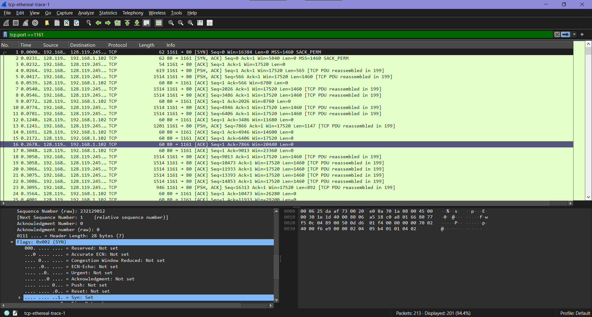
>jawab :Nomor urut (Sequence Number) = 0 (relative).Teridentifikasi sebagai SYN karena flag SYN = 1 dan flag lain = 0.
_____________________________________________________________________________________________________________________
2. Berapa nomor urut segmen SYNACK yang dikirim oleh gaia.cs.umass.edu ke komputer klien
sebagai balasan dari SYN? Berapa nilai dari field Acknowledgement pada segmen SYNACK?
Bagaimana gaia.cs.umass.edu menentukan nilai tersebut? Apa yang dimiliki oleh segmen
sehingga teridentifikasi sebagai segmen SYNACK?
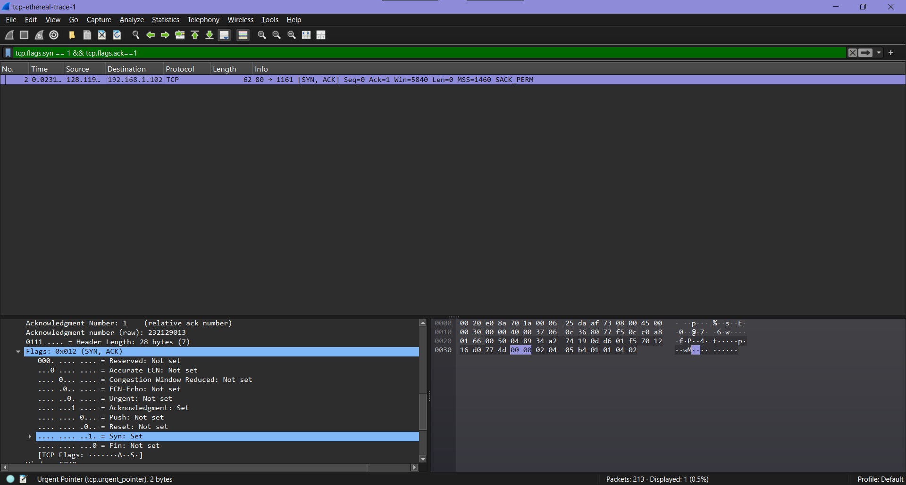
>jawab :Nomor urut (Sequence Number) = 0 (relative). Acknowledgement Number = 1 (hasil dari Seq SYN klien + 1). Teridentifikasi sebagai SYN-ACK karena flag SYN = 1 dan ACK = 1.
_____________________________________________________________________________________________________________________
3. Berapa nomor urut segmen TCP yang berisi perintah HTTP POST? Perhatikan bahwa untuk
menemukan perintah POST, Anda harus menelusuri content field milik paket di bagian
bawah jendela Wireshark, kemudian cari segmen yang berisi "POST" di bagian field DATAnya.
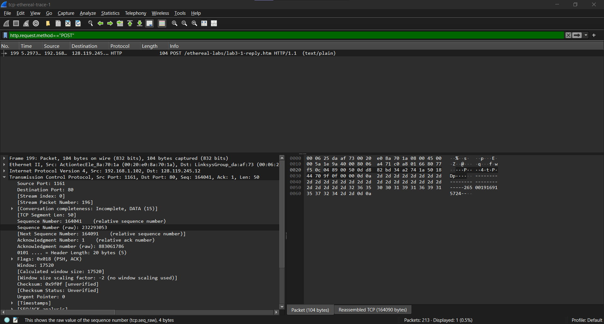
>jawab :

_____________________________________________________________________________________________________________________
4. Anggap segmen TCP yang berisi HTTP POST sebagai segmen pertama dalam koneksi TCP.
Berapa nomor urut dari enam segmen pertama dalam TCP (termasuk segmen yang berisi
HTTP POST)? Pada jam berapa setiap segmen dikirim? Kapan ACK untuk setiap segmen
diterima? Dengan adanya perbedaan antara kapan setiap segmen TCP dikirim dan kapan
acknowledgement-nya diterima, berapakah nilai RTT untuk keenam segmen tersebut?
Berapa nilai EstimatedRTT setelah penerimaan setiap ACK? (Catatan: Wireshark memiliki
fitur yang memungkinkan Anda untuk memplot RTT untuk setiap segmen TCP yang dikirim.
Pilih segmen TCP yang dikirim dari klien ke server gaia.cs.umass.edu pada jendela "daftar paket yang ditangkap". Kemudian pilih: Statistics->TCP Stream Graph- >Round Trip Time
Graph).
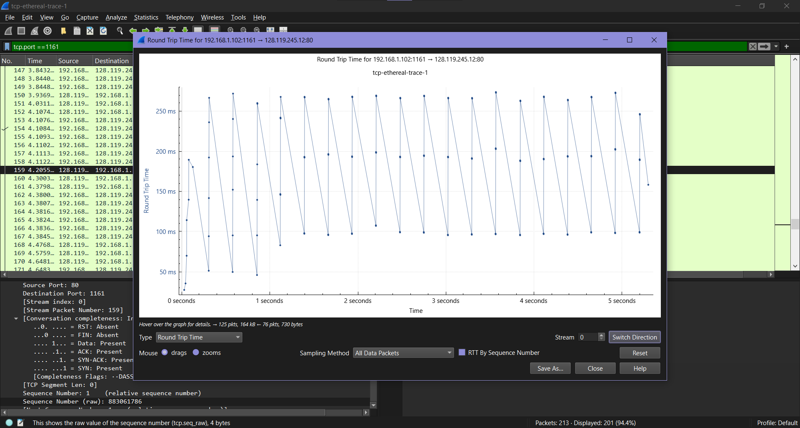
>jawab :Berdasarkan grafik Round Trip Time (RTT), waktu RTT untuk enam segmen tersebut relatif stabil, yaitu sekitar ±100–250 ms. Variasi RTT terjadi karena delay jaringan dan waktu pemrosesan di sisi penerima.
_____________________________________________________________________________________________________________________
5. Berapa panjang setiap enam segmen TCP pertama?
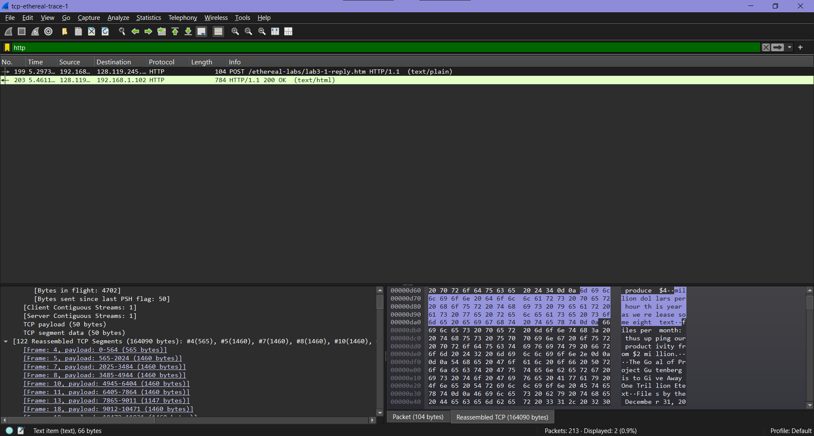
>jawab :panjang setiap segmen TCP pertama umumnya sebesar ±1460 byte (payload), yang merupakan nilai Maximum Segment Size (MSS) pada jaringan Ethernet.
_____________________________________________________________________________________________________________________
6. Berapa jumlah minimum ruang buffer tersedia yang disarankan kepada penerima dan
diterima untuk seluruh trace? Apakah kurangnya ruang buffer penerima pernah
menghambat pengiriman?
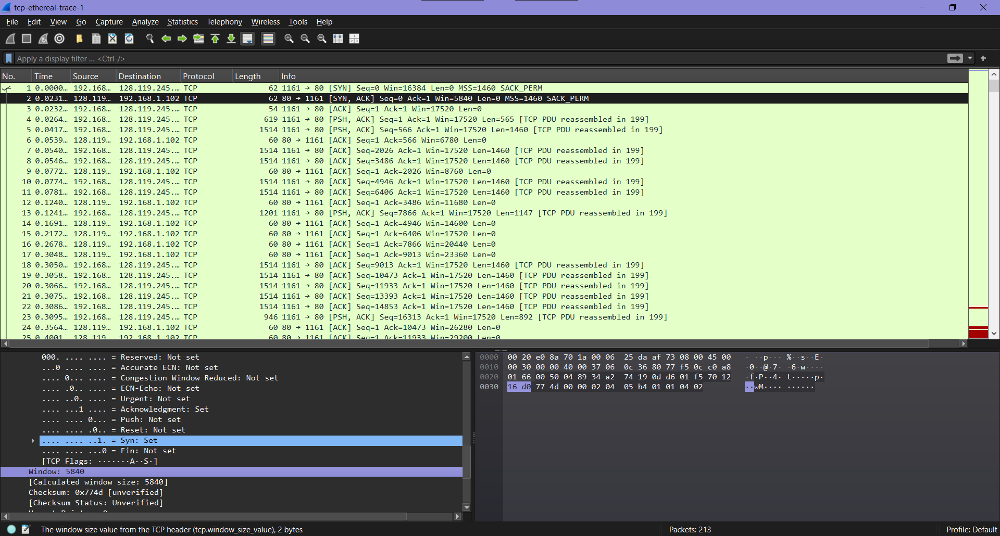
>jawab :Nilai minimum buffer yang diiklankan (Window Size) sekitar 5840 byte.

_____________________________________________________________________________________________________________________
7. Apakah ada segmen yang ditransmisikan ulang dalam file trace? Apa yang anda periksa (di
dalam file trace) untuk menjawab pertanyaan ini?
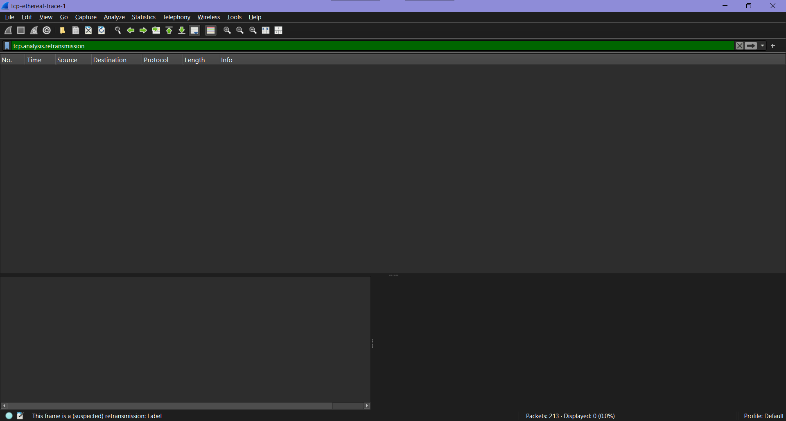
>jawab :Berdasarkan hasil pengamatan pada file trace menggunakan Wireshark, tidak ditemukan adanya segmen TCP yang ditransmisikan ulang (retransmission). Hal ini ditunjukkan dengan tidak adanya penanda seperti “TCP Retransmission” pada kolom informasi.
_____________________________________________________________________________________________________________________
8. Berapa banyak data yang biasanya diakui oleh penerima dalam ACK? Dapatkah anda
mengidentifikasi kasus-kasus di mana penerima melakukan ACK untuk setiap segmen yang
diterima?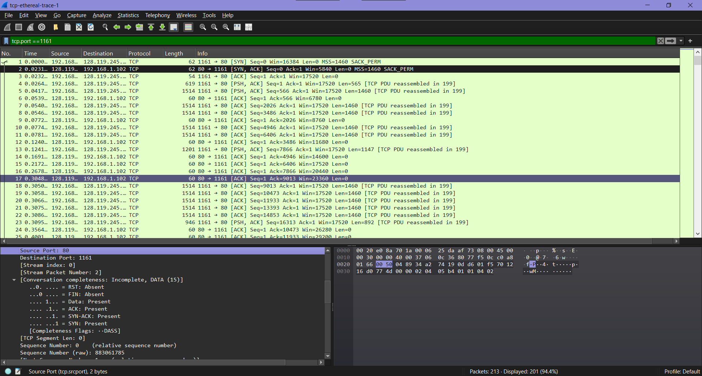
>jawab :ACK pada TCP bersifat kumulatif, artinya setiap ACK menyatakan bahwa semua data hingga byte tertentu sudah diterima dengan benar.Pada trace, nilai ACK terus meningkat secara berurutan, sehingga dapat disimpulkan bahwa semua data diterima dengan baik, berurutan, dan tidak ada data yang hilang atau diterima tidak lengkap.

_____________________________________________________________________________________________________________________
9. Berapa throughput (byte yang ditransfer per satuan waktu) untuk sambungan TCP?
Jelaskan bagaimana Anda menghitung nilai ini.
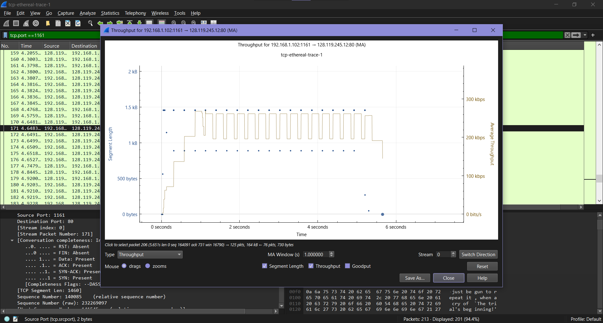
>jawab :Throughput adalah jumlah data yang berhasil ditransfer per satuan waktu. Berdasarkan grafik, nilai throughput TCP berada pada kisaran ±1.3–1.5 Mbps saat kondisi stabil. Nilai ini menunjukkan kecepatan efektif transfer data setelah koneksi TCP melewati fase awal.

_____________________________________________________________________________________________________________________
## Jawalah beberapa pertanyaan berikut menggunakan segmen TCP pada trace paket tcp-etherealtrace-1 di http://gaia.cs.umass.edu/wireshark-labs/wireshark-traces.zip .

1. Gunakan alat plotting Time-Sequence-Graph (Stevens) untuk melihat grafik nomor urut
berbanding waktu dari segmen yang dikirim oleh klien ke server gaia.cs.umass.edu.
Dapatkah Anda mengidentifikasi di mana fase “slow start” TCP dimulai dan berakhir, dan
pada bagian mana algoritma ”congestion avoidance” mengambil alih? Berikan komentar
tentang bagaimana data yang diukur berbeda dari perilaku ideal TCP yang telah kita pelajari.
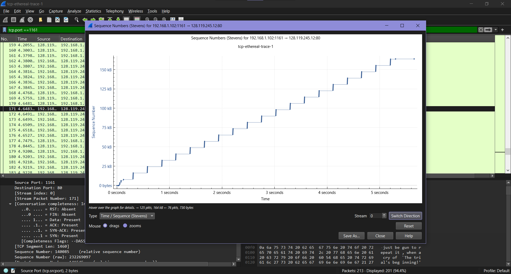
>jawab :Grafik ini menunjukkan hubungan antara waktu dan sequence number untuk melihat perilaku TCP.
Di awal koneksi terjadi slow start, ditandai dengan kenaikan cepat (eksponensial). Setelah itu, TCP masuk ke fase congestion avoidance, yang terlihat dari kenaikan linear yang lebih stabil.
